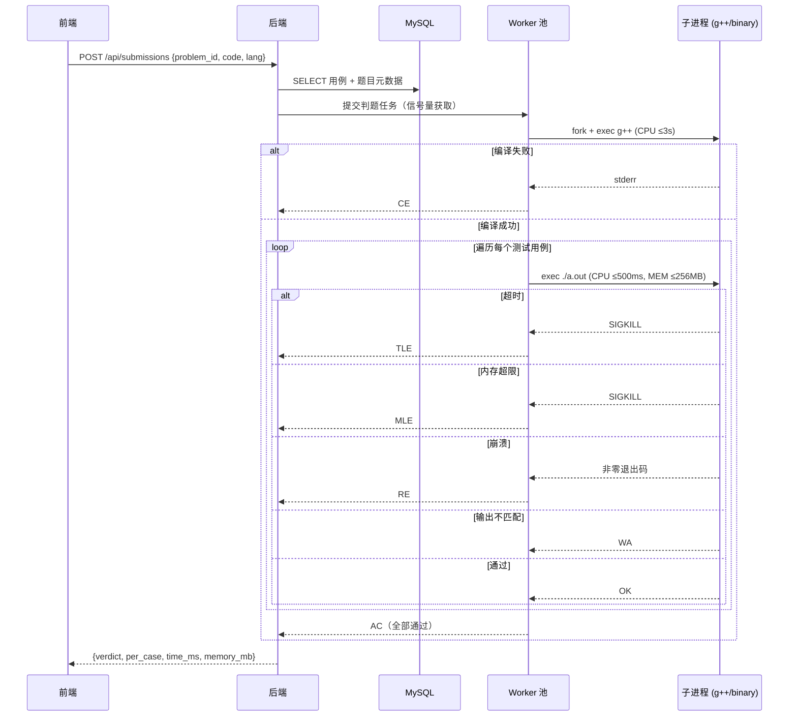
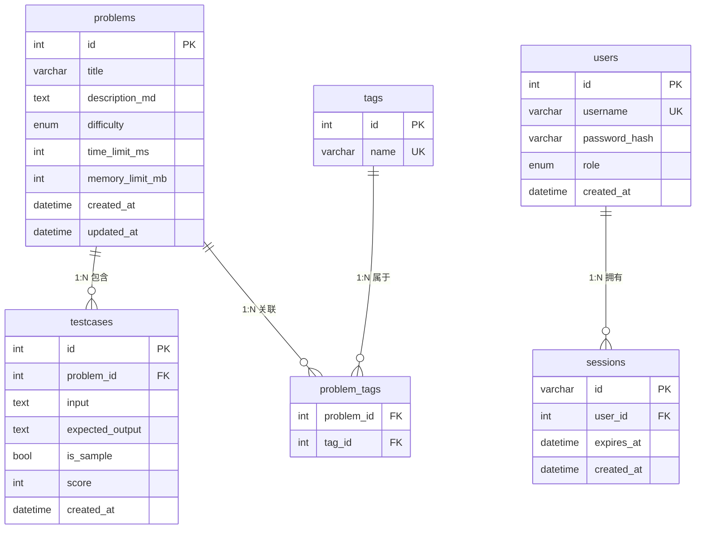
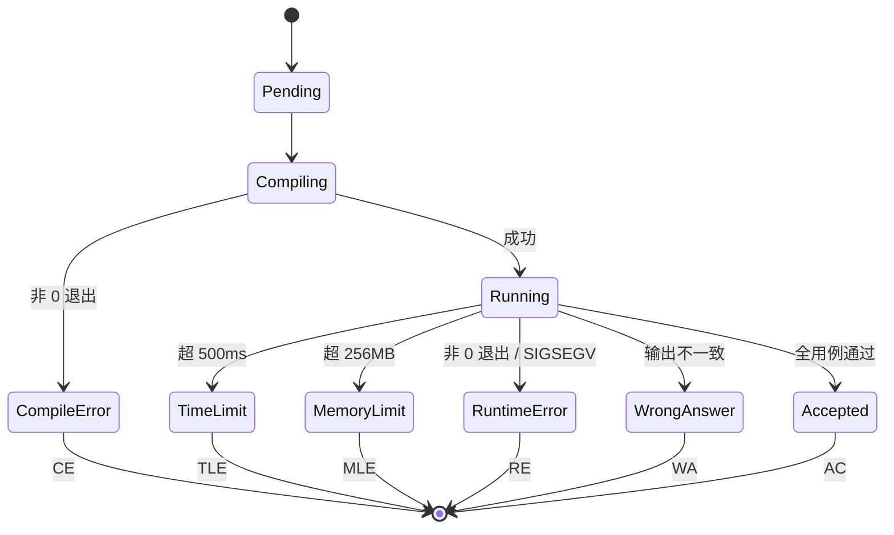

# MiniOJ — 仿 LeetCode 在线判题系统 SPEC

> 项目代号：**MiniOJ**
> 版本：v1.0（初稿）
> 文档状态：规格已冻结（等待验收）

---

## 1. 项目概述

### 1.1 一句话定位
面向**求职展示与教学训练**的轻量级在线判题系统，仿 LeetCode 的核心体验，单实例即可承载 1–40 人并发。

### 1.2 业务目标
- **求职展示**：作为候选人作品集，可一键部署演示。
- **教学训练**：小班/校内场景下刷题、考核的轻量平台。

### 1.3 成功标准（v1.0 收工定义）
- [ ] 执行 `docker compose up -d` 即可启动整套系统
- [ ] 浏览器可访问首页、查看题单、进入题目详情
- [ ] 普通用户可注册、登录、提交 C/C++ 代码并收到 AC/WA/TLE/CE/MLE/RE 结果
- [ ] 管理员登录后可对题目进行增删改查，并可一键重置题库
- [ ] 同时 8 个并发提交不出现崩溃或资源耗尽

---

## 2. 用户与角色

| 角色 | 登录 | 能力 |
|------|------|------|
| 匿名用户 | 不需要 | 浏览题单、查看题目详情、提交代码并查看结果 |
| 普通用户 | 需要（注册 + Session + Cookie） | 同匿名用户（不持久化提交记录，但可在前端展示"已登录"标识） |
| 管理员 | 需要（Session + Cookie） | 全部普通用户能力 + 后台 CRUD + 重置题库 |

> 设计权衡：
> - 管理员账号在首次启动时由 seed 脚本写入数据库（用户名 `admin`，随机密码输出到日志）。
> - 普通用户走自助注册流程：填写用户名 + 密码 → 后端校验唯一性 → bcrypt 加密入库 → 自动登录态。
> - 注册仅做"账号创建"，不收集邮箱/手机号，最大限度降低外部摩擦。

---

## 3. 技术栈

| 层 | 选型 | 理由 |
|----|------|------|
| 后端语言 | C++17 | 用户指定 |
| HTTP 框架 | cpp-httplib（header-only） | 用户指定；零依赖、易部署 |
| 数据库 | MySQL 8 | 用户指定；适合结构化题目数据 |
| 前端 | 原生 HTML + CSS + JS | 用户指定；CDN 引入 CodeMirror 6 作为编辑器 |
| 判题执行 | 本机 `fork` + `exec` + `setrlimit` | 用户指定；权衡后不做 seccomp/chroot |
| 构建系统 | CMake + 系统包 / vcpkg | 用户指定 |
| 容器化 | Docker Compose | 用户指定；一键启动 |

---

## 4. 系统架构

### 4.1 整体架构图

```mermaid
graph TB
    User[浏览器用户]
    Admin[管理员]

    subgraph Docker Compose
        Frontend[静态前端<br/>Nginx]
        Backend[C++ 后端<br/>cpp-httplib]
        MySQL[(MySQL 8)]
    end

    subgraph 判题子系统（同机进程内）
        WorkerPool[Worker 池<br/>信号量限制 ≤8]
        Compiler[g++ 编译]
        Runner[Runner<br/>rlimit 沙箱]
    end

    User --> Frontend
    Admin --> Frontend
    Frontend -->|REST| Backend
    Backend <-->|TCP 3306| MySQL
    Backend --> WorkerPool
    WorkerPool --> Compiler
    WorkerPool --> Runner
```

### 4.2 请求流转：判题流程



---

## 5. 数据模型

> 全部表均满足**第一范式（1NF）**：每个字段原子不可再分、不存在重复组。测试用例、标签等"一对多/多对多"属性全部拆为单独表，通过外键与题目关联。

### 5.1 ER 图



### 5.2 表关系说明

| 关系 | 类型 | 关联方式 |
|------|------|----------|
| `problems` — `testcases` | **1 : N** | 一道题包含多个测试用例，`testcases.problem_id` 外键引用 `problems.id` |
| `problems` — `tags` | **M : N** | 通过中间表 `problem_tags`（`problem_id` + `tag_id`）拆解 |
| `users` — `sessions` | 1 : N | 一个用户可有多端 Session（可选，MVP 可只保留一条） |

### 5.3 字段说明

**problems**
- `difficulty`：`easy | medium | hard`
- `time_limit_ms` / `memory_limit_mb`：判题资源限制（与判题子系统 § 8.1 对齐）

**testcases（1:N 独立表）**
- `problem_id`：FK → `problems.id`，级联删除
- `input` / `expected_output`：TEXT，存原始字符串（含换行）
- `is_sample`：true 时随题目详情返回给前端展示；false 时仅服务端判题用
- `score`：单用例分值（可选用，MVP 不强制要求总分计算）
- 索引：`(problem_id, id)`，按题目拉取全部用例时走索引扫描

**tags**
- `name`：唯一，如 `"数组"`、`"双指针"`
- 通过 `problem_tags` 联合主键 `(problem_id, tag_id)` 保证不重复关联

**users**
- `role`：`admin | user`
- `password_hash`：bcrypt

**sessions**（可选表；如改用 JWT + 无状态可省略）
- `id`：随机 32 字节 hex，作为 Cookie 值
- `expires_at`：TTL，到期由后端惰性清理

### 5.4 1NF 规范化决策
- **不再使用 JSON 数组字段**：原 `problems.tags` JSON 数组违反 1NF（字段非原子 + 重复组），已拆为 `tags` + `problem_tags` 两表，可按标签筛选、做 JOIN、统计。
- **测试用例必为单独表**：题目与用例是典型 1:N，用例数量大且需要独立 CRUD、级联删除，不能内嵌到 `problems` 行内。
- **可扩展性**：未来若加"题目分类 / 难度档位 / 出题人"等维度，均按 1NF 拆表，不在 `problems` 上堆 JSON。

### 5.5 不持久化的内容
- 用户提交的代码（仅在内存中流转）
- 提交记录（每次提交的结果只在 HTTP 响应中返回）

---

## 6. API 设计

所有接口统一返回 JSON。基础前缀：`/api`。

### 6.1 公开接口

| 方法 | 路径 | 说明 | 鉴权 |
|------|------|------|------|
| GET | `/api/problems` | 题单（不含 description） | 无 |
| GET | `/api/problems/:id` | 详情（含 description + sample 用例） | 无 |
| POST | `/api/submissions` | 提交判题 | 无 |

#### POST /api/submissions
请求：
```json
{
  "problem_id": 1,
  "lang": "cpp",
  "code": "#include <iostream>\n..."
}
```
响应：
```json
{
  "verdict": "WA",
  "time_ms": 12,
  "memory_mb": 3,
  "compile_output": "",
  "per_case": [
    {"index": 1, "verdict": "AC", "time_ms": 2},
    {"index": 2, "verdict": "WA", "time_ms": 5, "expected": "1 2", "actual": "1 3"}
  ]
}
```
verdict 取值：`AC | WA | TLE | CE | MLE | RE`

### 6.2 用户账号接口

| 方法 | 路径 | 说明 | 鉴权 |
|------|------|------|------|
| POST | `/api/auth/register` | 普通用户注册 | 无 |
| POST | `/api/auth/login` | 普通用户登录，返回 Set-Cookie | 无 |
| POST | `/api/auth/logout` | 普通用户注销 | Session |
| GET | `/api/auth/me` | 获取当前登录用户信息 | Session |

#### POST /api/auth/register
请求：
```json
{
  "username": "alice",
  "password": "Passw0rd!"
}
```
响应（成功）：
```json
{
  "id": 2,
  "username": "alice",
  "role": "user"
}
```
响应（失败）：
- `400` 参数缺失 / 校验失败（用户名长度、密码强度）
- `409` 用户名已存在

**校验规则**：
- `username`：3–20 位，仅允许字母/数字/下划线，唯一
- `password`：8–64 位，至少包含字母与数字
- 后端 bcrypt 加密后写入 `users` 表，`role='user'`
- 注册成功自动建立 Session（等价于登录），返回 `Set-Cookie`

### 6.3 管理员接口（Session + Cookie 鉴权）

| 方法 | 路径 | 说明 |
|------|------|------|
| POST | `/api/admin/login` | 登录，返回 Set-Cookie |
| POST | `/api/admin/logout` | 注销 |
| GET | `/api/admin/problems` | 题单（含完整数据） |
| POST | `/api/admin/problems` | 新建题目 |
| GET | `/api/admin/problems/:id` | 详情（含全部用例） |
| PUT | `/api/admin/problems/:id` | 更新题目 |
| DELETE | `/api/admin/problems/:id` | 删除题目 |
| POST | `/api/admin/testcases` | 新增用例 |
| PUT | `/api/admin/testcases/:id` | 更新用例 |
| DELETE | `/api/admin/testcases/:id` | 删除用例 |
| POST | `/api/admin/reset` | 重置题库为 seed 数据 |

---

## 7. 前端页面

### 7.1 页面清单

| 路径 | 页面 | 说明 |
|------|------|------|
| `/` | 题目列表页 | 卡片网格，按难度/标签筛选 |
| `/problem/:id` | 题目详情页 | 左描述、右代码、下结果 |
| `/login` | 登录页 | 普通用户登录（账号 + 密码） |
| `/register` | 注册页 | 普通用户注册（账号 + 密码 + 确认密码） |
| `/admin/login` | 后台登录 | 管理员账号密码 |
| `/admin` | 后台管理页 | 题库 CRUD 表格 + 重置按钮 |
| `/admin/edit/:id` | 题目编辑 | 描述 / 用例表单 |

### 7.2 注册页 `/register`

```
┌──────────────────────────────────────────────────────────────┐
│  Header: Logo  |  题单  |  登录入口                          │
├──────────────────────────────────────────────────────────────┤
│                                                              │
│             ┌────────────────────────────┐                  │
│             │   注 册 账 号              │                  │
│             │                            │                  │
│             │   用户名: [_____________]  │                  │
│             │   密  码: [_____________]  │                  │
│             │   确认密码: [____________] │                  │
│             │                            │                  │
│             │   [   注  册   ]           │                  │
│             │                            │                  │
│             │   已有账号？前往登录        │                  │
│             └────────────────────────────┘                  │
│                                                              │
└──────────────────────────────────────────────────────────────┘
```

**交互流程**：
1. 实时校验：用户名格式、密码强度、两次密码一致性
2. 提交 `POST /api/auth/register`
3. 成功 → 自动登录（Set-Cookie）→ 跳转 `/`
4. 失败 → 表单内联显示错误（用户名已存在 / 参数不合法）
5. 注册按钮 loading 态防重复提交

### 7.3 登录页 `/login`

```
┌──────────────────────────────────────────────────────────────┐
│  Header: Logo  |  题单  |  注册入口                          │
├──────────────────────────────────────────────────────────────┤
│             ┌────────────────────────────┐                  │
│             │   登 录                    │                  │
│             │                            │                  │
│             │   用户名: [_____________]  │                  │
│             │   密  码: [_____________]  │                  │
│             │                            │                  │
│             │   [   登  录   ]           │                  │
│             │                            │                  │
│             │   还没有账号？立即注册      │                  │
│             │   管理员入口 →             │                  │
│             └────────────────────────────┘                  │
└──────────────────────────────────────────────────────────────┘
```

**交互流程**：
1. 提交 `POST /api/auth/login`
2. 成功 → 写入 `Set-Cookie` → 跳转 `/`
3. 失败 → 显示错误提示（用户名或密码错误）
4. Header 根据登录态切换：未登录显示"登录 / 注册"；已登录显示"用户名 ▾ (退出)"

### 7.4 题目详情页布局（仿 LeetCode）

```
┌──────────────────────────────────────────────────────────────┐
│  Header: Logo  |  题单  |  登录/用户名                       │
├──────────────────────────┬───────────────────────────────────┤
│                          │  语言: [C++ ▾]   模板: [加载]      │
│   题目描述 (Markdown)     ├───────────────────────────────────┤
│                          │                                   │
│   - 描述                   │   CodeMirror 6 编辑器              │
│   - 样例输入/输出         │   (语法高亮、自动缩进)              │
│   - 提示                   │                                   │
│                          │                                   │
│                          │   [提交]  [重置]                   │
├──────────────────────────┴───────────────────────────────────┤
│  判题结果: WA (第 2/5 用例)                                   │
│  - Case 1: AC (2ms)                                          │
│  - Case 2: WA — Expected "1 2" / Got "1 3"                    │
│  ...                                                           │
└──────────────────────────────────────────────────────────────┘
```

### 7.5 视觉风格
- 暗色主题（背景 `#1a1a1a`、卡片 `#262626`、主色 `#ffa116` 仿 LeetCode 橙）
- 卡片化题单，难度徽章着色
- 响应式适配桌面优先

---

## 8. 判题机制

### 8.1 资源限制（rlimit）

| 资源 | 限制 |
|------|------|
| 单用例 CPU 时间 | ≤ 500 ms（超出 TLE） |
| 单次提交总 CPU 时间（含所有用例） | ≤ 2 s（隐含上限） |
| 编译时间 | ≤ 3 s（超出 CE） |
| 内存 | ≤ 256 MB（超出 MLE） |
| 输出 | ≤ 16 MB（防止刷盘） |
| 子进程数 | ≤ 8（信号量控制，并发任务上限） |
| 文件大小 | 临时目录 ≤ 10 MB |

### 8.2 判题状态机



### 8.3 并发控制
- 使用 `std::counting_semaphore<8>` 或 `std::mutex + std::condition_variable` 实现信号量
- 超出并发上限的提交进入内存队列，按 FIFO 调度
- 子进程清理采用 `SIGCHLD` + `waitpid` 非阻塞回收，避免僵尸进程

### 8.4 安全策略（已知权衡）
**只采用 rlimit，不做 seccomp / chroot / setuid**。
- **风险**：恶意代码可调用 `fork` / `execve` / 写文件 / 联网。
- **缓解**：因系统面向"求职展示 + 教学训练"，用户基本可信；管理员只允许内网访问。
- **不做 seccomp 的理由**：增加复杂度与兼容性负担；MVP 优先级。
- **未来**：若对外开放，需迁移到 Docker 或 nsjail。

---

## 9. 部署

### 9.1 Docker Compose 服务清单

| 服务 | 镜像 | 端口 | 说明 |
|------|------|------|------|
| `mysql` | `mysql:8.0` | 3306（仅内网） | 持久化数据卷 |
| `backend` | 本地构建 `minioj-backend` | 8080 | C++ 二进制 |
| `frontend` | `nginx:alpine` | 80 | 反向代理 + 静态文件 |
| `seed` | 本地构建（一次性） | - | 首次启动初始化题库与管理员 |

### 9.2 启动流程

```bash
docker compose up -d          # 启动 mysql + backend + frontend
docker compose run --rm seed  # 首次执行：建表 + 写入 seed 题目 + 创建 admin
# 访问 http://localhost
# 管理员账号: admin / (启动时由 seed 生成的随机密码，输出到日志)
```

### 9.3 目录结构

```
minioj/
├── docker-compose.yml              # 一键编排：mysql / backend / frontend / seed
├── README.md                       # 启动步骤、默认账号、注册流程
├── SPEC.md                         # 本文档
├── .env.example                    # 环境变量样例（DB 密码、Session TTL 等）
├── .gitignore
│
├── backend/                        # ─── C++17 后端（cpp-httplib）
│   ├── CMakeLists.txt
│   ├── Dockerfile                  # 多阶段构建：基础镜像含 g++ / mysql-client
│   ├── third_party/
│   │   ├── httplib.h               # cpp-httplib 单头
│   │   └── *(已删除：bcrypt 改用 apt `libcrypt-dev`)*
│   ├── include/                    # 公共头文件
│   │   ├── common.hpp
│   │   ├── config.hpp
│   │   └── types.hpp
│   ├── src/
│   │   ├── main.cpp                # 入口：读配置 → 起 HTTP → 注册路由
│   │   ├── http/                   # 路由 & 中间件
│   │   │   ├── router.hpp / .cpp   # 路由表集中注册
│   │   │   ├── middleware.hpp / .cpp # Session 解析、CORS、错误处理
│   │   │   ├── handlers_public.cpp # /api/problems、/api/submissions
│   │   │   ├── handlers_auth.cpp   # /api/auth/{register,login,logout,me}
│   │   │   └── handlers_admin.cpp  # /api/admin/*
│   │   ├── db/                     # 数据访问层
│   │   │   ├── pool.hpp / .cpp     # MySQL 连接池
│   │   │   ├── problem_dao.cpp     # problems / testcases / tags / problem_tags
│   │   │   ├── user_dao.cpp        # users / sessions
│   │   │   └── migrate.cpp         # 启动时校验表结构
│   │   ├── judge/                  # 判题核心
│   │   │   ├── worker_pool.cpp     # 信号量 ≤8 + FIFO 队列
│   │   │   ├── compiler.cpp        # g++ 编译子进程（3s 超时）
│   │   │   ├── runner.cpp          # rlimit 沙箱 + 跑单个用例
│   │   │   ├── diff.cpp            # 输出比对（AC / WA）
│   │   │   └── pipeline.cpp        # 编排：编译 → 遍历用例 → 汇总
│   │   ├── auth/                   # 鉴权
│   │   │   ├── session.cpp         # Session 创建 / 校验 / 销毁
│   │   │   ├── password.cpp        # bcrypt 封装
│   │   │   └── validator.cpp       # 用户名 / 密码强度校验
│   │   └── util/                   # 工具
│   │       ├── config.cpp          # 读 .env / 环境变量
│   │       ├── logger.cpp          # 简易日志
│   │       └── signal.cpp          # SIGCHLD / SIGTERM 处理
│   ├── sql/
│   │   ├── schema.sql              # 建表 DDL：problems / testcases / tags / problem_tags / users / sessions（1NF）
│   │   └── seed.sql                # 内置 admin 与种子标签
│   ├── seed/
│   │   ├── problems.json           # 内置题目（含用例 + 标签名数组）
│   │   └── tags.json               # 内置标签字典
│   ├── scripts/
│   │   └── seed.cpp                # 独立 seed 进程（读 JSON → 写入 DB）
│   └── tests/                      # 单元 / 集成测试（可选）
│       ├── test_diff.cpp
│       └── test_validator.cpp
│
└── frontend/                       # ─── 静态前端（Nginx）
    ├── Dockerfile                  # 基于 nginx:alpine，COPY public/
    ├── nginx.conf                  # 反代 /api → backend:8080
    └── public/
        ├── index.html              # 题目列表页（卡片网格 + 难度/标签筛选）
        ├── problem.html            # 题目详情页（描述 / 编辑器 / 结果）
        ├── login.html              # 普通用户登录页
        ├── register.html           # 普通用户注册页
        ├── admin/
        │   ├── login.html          # 管理员登录页
        │   ├── index.html          # 后台管理页（题库表格 + CRUD + 重置）
        │   └── edit.html           # 题目编辑页（描述 / 用例 / 标签）
        ├── css/
        │   ├── common.css          # 全局变量、Header、按钮
        │   ├── theme.css           # 暗色主题（#1a1a1a / #ffa116）
        │   ├── problem.css         # 题目页布局
        │   ├── auth.css            # 登录 / 注册卡片
        │   └── admin.css           # 后台表格 / 表单
        ├── js/
        │   ├── api.js              # fetch 封装，自动带 cookie、统一错误处理
        │   ├── auth.js             # /api/auth/me 探测、Header 登录态切换
        │   ├── problem_list.js     # 列表页卡片渲染 + 筛选
        │   ├── problem_detail.js   # 题目详情 + 提交 + 结果渲染
        │   ├── editor.js           # CodeMirror 6 初始化 / 模板加载
        │   ├── register.js         # 注册表单实时校验 + 提交
        │   ├── login.js            # 登录表单提交
        │   ├── admin_list.js       # 后台题库表格 + CRUD
        │   └── admin_edit.js       # 题目编辑（含用例增删）
        ├── vendor/                 # 本地化的第三方库（避免 CDN 依赖）
        │   ├── marked.min.js       # Markdown 渲染
        │   └── codemirror/         # CodeMirror 6 bundle
        │       ├── editor.js
        │       ├── cpp.js
        │       └── ...
        └── assets/
            ├── logo.svg
            └── favicon.ico
```

### 9.4 依赖与安装指令

#### 9.4.1 依赖总览

| 组件 | 用途 | 版本建议 | 必需 | 安装位置 |
|------|------|----------|------|----------|
| **Docker Engine** | 容器运行时 | ≥ 24.0 | 容器化路径必需 | 宿主机 |
| **Docker Compose** | 一键编排 | v2（`docker compose`） | 容器化路径必需 | 宿主机 |
| **MySQL 8.0** | 题库 / 用户 / Session 持久化 | 8.0.x | 容器内自带，裸机需装 | 容器 / 宿主机 |
| **Nginx** | 托管前端 + 反代 `/api` | ≥ 1.22 (alpine) | 容器内自带 | 容器内 |
| **g++** | 编译后端二进制 + 判题子进程 | ≥ 9（C++17 完整支持） | 后端必需 | 容器 / 宿主机 |
| **CMake** | 后端构建 | ≥ 3.16 | 后端构建必需 | 容器 / 宿主机 |
| **make / ninja** | 实际构建工具 | 系统默认即可 | 后端构建必需 | 容器 / 宿主机 |
| **libmysqlclient-dev** | MySQL C API | 与服务端版本匹配 | 后端连库必需 | 容器 / 宿主机 |
| **libjsoncpp-dev** | JSON 解析与序列化 | ≥ 1.9（pkg-config 提供 `jsoncpp`） | 后端 API 必需 | 容器 / 宿主机 |
| **libssl-dev** | cpp-httplib HTTPS 可选 | OpenSSL ≥ 1.1 | 可选（HTTPS 部署时） | 宿主机 |
| **bcrypt 实现** | 用户密码哈希 | apt `libcrypt-dev`（glibc `crypt(3)` 提供 bcrypt `$2b$`） | 注册/登录必需 | 后端系统依赖 |
| **cpp-httplib** | HTTP 服务 | 最新单头 | 后端必需 | 后端 third_party（vendored） |
| **marked.js** | 前端 Markdown 渲染 | ≥ 12 | 前端必需 | 前端 vendor |
| **CodeMirror 6** | 代码编辑器 | ≥ 6.x | 前端必需 | 前端 vendor |

> 标"容器内自带"表示 `docker compose up -d` 自动从镜像拉取，宿主机无需安装。

#### 9.4.2 容器化路径（推荐，Ubuntu 优先 apt）

宿主机**仅需** Docker + Compose，其余工具链全部在 `backend/Dockerfile` 与官方镜像内构建。

> **优先策略**：默认走 **Ubuntu 官方 APT 源里的 `docker.io` 包**，避免访问 `download.docker.com`（代理不稳定时该外网源常断）。如必须使用 Docker 官方较新版，再切到 § 9.4.7 的镜像源。

**方式 A：Ubuntu 官方 apt 源（推荐，几乎零外网）**

```bash
sudo apt-get update
sudo apt-get install -y docker.io docker-compose-v2   # Ubuntu 22.04+ 包名
# Ubuntu 20.04：sudo apt-get install -y docker.io docker-compose
sudo usermod -aG docker $USER                         # 重新登录后免 sudo
newgrp docker

# 验证
docker --version                # 20.10.x 起步，足以本项目使用
docker compose version          # v2.x
```

**方式 B：Docker 官方源（如确需较新版本，请走 § 9.4.7 的镜像源，避免直接访问官方域名）**

```bash
sudo apt-get install -y ca-certificates curl gnupg
sudo install -m 0755 -d /etc/apt/keyrings
# ↓↓↓ 此处替换为 § 9.4.7 的镜像源域名 ↓↓↓
curl -fsSL https://mirrors.tuna.tsinghua.edu.cn/docker-ce/linux/ubuntu/gpg \
  | sudo gpg --dearmor -o /etc/apt/keyrings/docker.gpg
sudo chmod a+r /etc/apt/keyrings/docker.gpg
echo \
  "deb [arch=$(dpkg --print-architecture) signed-by=/etc/apt/keyrings/docker.gpg] \
  https://mirrors.tuna.tsinghua.edu.cn/docker-ce/linux/ubuntu $(. /etc/os-release && echo "$VERSION_CODENAME") stable" \
  | sudo tee /etc/apt/sources.list.d/docker.list > /dev/null
sudo apt-get update
sudo apt-get install -y docker-ce docker-ce-cli containerd.io docker-buildx-plugin docker-compose-plugin
```

启动项目（一条命令搞定）：

```bash
docker compose up -d            # 拉镜像、构建后端、起 mysql + backend + frontend
docker compose run --rm seed    # 首次：建表 + 灌种子题 + 创建 admin
```

#### 9.4.3 裸机 / 开发机路径（不通过 Docker）

##### Ubuntu / Debian（apt 一行装齐）

> 所有包均在 Ubuntu 官方源可达，**无需第三方 PPA**。Ubuntu 22.04+ 包名使用 `default-libmysqlclient-dev`。

```bash
sudo apt-get update
sudo apt-get install -y \
    build-essential cmake ninja-build pkg-config \
    g++ \
    default-libmysqlclient-dev libjsoncpp-dev libssl-dev \
    default-mysql-client \
    nginx
# Ubuntu 20.04：把 default-libmysqlclient-dev / default-mysql-client 换成 libmysqlclient-dev / mysql-client
```

##### RHEL / CentOS / Fedora

```bash
# RHEL 9 / Fedora
sudo dnf install -y \
    gcc-c++ cmake ninja-build pkgconfig \
    openssl-devel \
    jsoncpp-devel \
    mysql mysql-devel \
    nginx

# CentOS 7（需要 EPEL；MySQL 官方源需外网，建议改用 MariaDB）
sudo yum install -y epel-release
sudo yum install -y gcc-c++ cmake3 jsoncpp-devel mariadb-devel openssl-devel nginx
sudo alternatives --install /usr/local/bin/cmake cmake /usr/bin/cmake3 30
```

##### macOS（Homebrew + Apple Silicon，仅供本机开发参考）

```bash
brew install cmake ninja pkg-config mysql-client openssl nginx jsoncpp
brew install mysql && brew services start mysql
```

#### 9.4.4 后端 C++ 第三方库

后端 C++ 依赖采用「**Vendored 单头 + 系统 pkg-config**」混合策略：

- 单头库（`cpp-httplib`）随仓库 `third_party/` 交付，零网络依赖；bcrypt 改由 apt `libcrypt-dev` 提供
- JSON 解析使用 **jsoncpp**，通过系统包提供，由 CMake 的 `pkg_check_modules(JSONCPP REQUIRED ...)` 链接（详见 §9.4.1 / §9.4.3 中 `libjsoncpp-dev` / `jsoncpp-devel` 安装方式）

**(a) Vendored 单头（默认，零网络）**

仓库根目录的 `backend/third_party/` 已托管：

| 库 | 路径 | 说明 |
|----|------|------|
| cpp-httplib | `third_party/httplib.h` | 单头 |
| bcrypt | apt `libcrypt-dev`（glibc `crypt(3)` `$2b$`） | 系统 C 标准库；`<crypt.h>` |

`CMakeLists.txt` 已通过 `target_include_directories(... third_party)` 直接引用，**离线即可编译**。

如需手动替换最新版本（可选，需要稳定代理）：

```bash
cd backend/third_party
curl -fL https://raw.githubusercontent.com/yhirose/cpp-httplib/master/httplib.h -o httplib.h
```

**(b) vcpkg（可选，需要稳定代理 + git）**

> 当前项目仅 vendored 上述两个单头库，其余依赖（MySQL 客户端、jsoncpp）走系统包；vcpkg 路径仅在你想把 jsoncpp / MySQL 也通过 vcpkg 链接时使用。

```bash
sudo apt-get install -y git curl zip unzip tar pkg-config   # apt 装齐前置
git clone https://github.com/microsoft/vcpkg ~/vcpkg
~/vcpkg/bootstrap-vcpkg.sh
echo 'export VCPKG_ROOT=$HOME/vcpkg' >> ~/.bashrc

# 仅当希望通过 vcpkg 提供 jsoncpp / libmysqlclient 时安装，否则继续用 §9.4.3 的系统包
~/vcpkg/vcpkg install jsoncpp libmysqlclient

cmake -S backend -B backend/build \
    -DCMAKE_TOOLCHAIN_FILE=$VCPKG_ROOT/scripts/buildsystems/vcpkg.cmake \
    -DCMAKE_BUILD_TYPE=Release
cmake --build backend/build -j
```

#### 9.4.5 前端第三方库（**默认 vendored，零网络**）

> `frontend/public/vendor/` 目录随仓库一起交付，clone 后即可离线使用，不依赖任何 CDN。**正常情况下不需要执行下面任何命令**。

如首次 clone 后 `vendor/` 为空（极少见），或需要升级版本，按需选用：

```bash
# marked.js（备用脚本）
curl -fL https://cdn.jsdelivr.net/npm/marked/marked.min.js \
  -o frontend/public/vendor/marked.min.js

# CodeMirror 6（备用脚本）
mkdir -p frontend/public/vendor/codemirror && cd $_
npm pack codemirror @codemirror/lang-cpp @codemirror/theme-one-dark
for t in *.tgz; do tar -xf "$t" && mv package/* . && rm -rf package; rm "$t"; done
```

页面引用统一使用**相对路径**，避免 CDN 依赖：

```html
<script src="/vendor/marked.min.js"></script>
<script type="module" src="/vendor/codemirror/editor.js"></script>
```

#### 9.4.6 验证安装

```bash
# 后端工具链
g++ --version          # 期望 ≥ 9
cmake --version        # 期望 ≥ 3.16
mysql --version        # 客户端可用

# 数据库连通（容器化路径下，等 mysql 就绪后）
docker compose exec mysql mysqladmin ping -h localhost -uroot -p"$MYSQL_ROOT_PASSWORD"

# 一键冒烟（完整启动后）
curl -fsSL http://localhost/                  # 应返回题单页 HTML
curl -fsSL http://localhost/api/problems | jq # 应返回 JSON 数组
```

#### 9.4.7 国内 / 镜像源替换（Ubuntu + Docker）

> 当代理不稳定或默认源被墙时，切换到国内镜像。所有操作都在 Ubuntu 官方源的可达范围内完成。

**(a) Ubuntu APT 源 → 清华源**

```bash
sudo cp /etc/apt/sources.list /etc/apt/sources.list.bak
sudo sed -i 's|http://archive.ubuntu.com|https://mirrors.tuna.tsinghua.edu.cn|g; \
             s|http://security.ubuntu.com|https://mirrors.tuna.tsinghua.edu.cn|g' \
             /etc/apt/sources.list
sudo apt-get update
```

也可用中科大 `mirrors.ustc.edu.cn/ubuntu` 或阿里云 `mirrors.aliyun.com/ubuntu`。

**(b) Docker 镜像源（用于 `docker pull` 加速）**

新建/编辑 `/etc/docker/daemon.json`：

```json
{
  "registry-mirrors": [
    "https://docker.mirrors.tuna.tsinghua.edu.cn",
    "https://hub-mirror.c.163.com",
    "https://mirror.baidubce.com"
  ]
}
```

```bash
sudo systemctl restart docker
docker info | grep -A1 "Registry Mirrors"   # 确认生效
```

**(c) MySQL 镜像拉取（如使用自建 MySQL 容器而非官方）**

`docker-compose.yml` 中镜像改写为：

```yaml
mysql:
  image: mysql:8.0
  # 若 docker.io 拉取慢，可在 daemon.json 里加 mirrors 后重试
```

#### 9.4.8 代理不稳定的兜底策略

| 场景 | 现象 | 兜底方案 |
|------|------|----------|
| `apt-get update` 超时 | 默认源被墙 / 慢 | § 9.4.7(a) 切清华源 |
| `download.docker.com` 不可达 | Docker 官方源失败 | § 9.4.2 方式 A（apt 装 `docker.io`）或 § 9.4.7(b) 用清华 Docker 镜像 |
| `docker pull mysql:8.0` 拉镜像慢 | 跨国网络差 | § 9.4.7(b) 配 `registry-mirrors` |
| `curl github.com` 失败 | 无法 `git clone` vcpkg / 下 httplib | § 9.4.4(a) 直接用 vendored，零网络 |
| `npm pack codemirror` 失败 | 前端 vendor 缺失 | § 9.4.5 已默认随仓库交付，**无需执行该命令** |
| 仅 HTTP 代理可用，无科学上网 | 多数外网断 | 给 `apt` / `docker` / `curl` / `git` 设 `http_proxy` / `https_proxy` 环境变量；或仅使用 `mirrors.tuna.tsinghua.edu.cn` 域内资源 |
| 完全离线 | 无任何外网 | 提前在有网机器 `apt-get download` + `docker save` 打包，复制到目标机 `dpkg -i` / `docker load` |

**给 apt / docker 配置 HTTP 代理（一次性）**

```bash
sudo mkdir -p /etc/systemd/system/docker.service.d
sudo tee /etc/systemd/system/docker.service.d/proxy.conf <<'EOF'
[Service]
Environment="HTTP_PROXY=http://your-proxy:port"
Environment="HTTPS_PROXY=http://your-proxy:port"
Environment="NO_PROXY=localhost,127.0.0.1"
EOF
sudo systemctl daemon-reload && sudo systemctl restart docker

# apt 代理（apt 本身不走环境变量，需写配置）
sudo tee /etc/apt/apt.conf.d/95proxy <<'EOF'
Acquire::http::Proxy  "http://your-proxy:port";
Acquire::https::Proxy "http://your-proxy:port";
EOF
```

---

## 10. TODO 清单（分阶段）

> **约定**：每个 Phase 全部完成后，必须同步更新本节勾选状态并提交 commit。
> 部分完成的子项保留 `[ ]`，不勾选。

### Phase 0：脚手架
- [x] 仓库目录结构初始化
- [x] README 草案
- [x] `docker-compose.yml` 骨架
- [x] backend `CMakeLists.txt` + cpp-httplib 接入
- [x] 后端配置管理、日志封装与 MySQL 连接池
- [x] frontend 静态页骨架（首页 + 题目页占位）
- [x] **MySQL 建表 DDL**：`problems` / `testcases`（1:N）/ `tags` / `problem_tags` / `users` / `sessions`，全部符合 1NF，含索引与外键级联策略

### Phase 1：基础 HTTP 与题单展示
- [x] 后端：`/api/problems`、`/api/problems/:id` 实现
- [x] 前端：首页题单卡片渲染
- [x] 前端：题目详情 Markdown 渲染（marked.js CDN）

### Phase 2：用户账号体系（注册 / 登录 / 注销）

> **拆分落地**：Phase 2-A 会话管理基础（已完成）/ Phase 2-B 登录注册流程（待续）。
> 阶段 A 落地以下三项：session 工具、`GET /api/auth/me`、`users.username` 唯一索引。
> register/login/logout 与前端注册登录页保留为阶段 B。

- [x] 后端 session 工具：`auth::session`（64 hex 随机 id / `isSessionIdShape` / `formatSessionCookie` 写 / `formatClearSessionCookie` 清除），Cookie 名 `minioj_sid`、`HttpOnly; SameSite=Lax; Max-Age=ttl[; Secure]`
- [x] 后端 `db/user_dao`：`findUserByUsername` / `findUserById` / `createSession` / `findUserByValidSessionId`（带 `expires_at > NOW()` 过滤）/ `deleteSession`
- [x] 后端 `http/middleware`：解析 `Cookie` 头 → `parseSessionId`；写 `Set-Cookie` → `attachSessionCookie` / `clearSessionCookie`；共享 `writeJson` / `writeError`
- [x] 后端 `http/router`：`registerAllRoutes` 总入口，集中接入 auth/public/admin 三组
- [x] 后端：`GET /api/auth/me`（无/无效/过期 → 401；有效 → 200 + `{id, username, role}`）
- [x] 单元测试 `test_session`（9 例）：id 长度/小写 hex/唯一性、shape 接受/拒绝、Set-Cookie/Clear-Cookie 字段
- [x] 单元测试 `test_user_dao`（24 例）：`UserDaoFindTest` ×4 + `UserDaoSessionTest` ×8 + `MiddlewareParseTest` ×7 + `MiddlewareWriteTest` ×2 + `MiddlewareCookieTest` ×4；DAO 用例依赖真实 MySQL（`DB_PASSWORD` 未设置时 `GTEST_SKIP`），并发现并修复 `expires_at > NOW()` 在 UTC 写入/服务器本地时区下误判过期的 bug
- [x] 后端 `auth/password`：bcrypt-12 包装（`hashPassword` / `verifyPassword`）；通过 apt `libcrypt-dev` 提供的 `<crypt.h>` `crypt(3)`，CMake 链 `${CRYPT_LIB}`；**已删 vendored `third_party/bcrypt.{h,cpp}`**
- [x] 后端 `auth/validator`：`validateUsername` 3-20 `[A-Za-z0-9_]` + `validatePassword` 8-64 含字母与数字，错误统一抛 `invalid_argument`
- [x] 后端：`POST /api/auth/register`：parse JSON → validate → bcrypt → `db::createUser`（捕获 `mysql_errno 1062` 转 `UsernameExistsError`） → `createSession` + `Set-Cookie` → 201；失败 400 / 409
- [x] 后端：`POST /api/auth/logout`：解析 cookie → `db::deleteSession` → `clearSessionCookie` → 200（cookie 不存在也返回 200）
- [ ] 后端：`POST /api/auth/login`（阶段 C：bcrypt 校验 + Session 写入 + Set-Cookie）
- [x] 前端：注册页 `register.html` + `register.js`（含用户名/密码/确认密码三字段，实时校验显示绿色 ✓ / 红色 ✗，loading 防重复，409 标到 username hint，提交成功跳首页）
- [ ] 前端：登录页 `login.html`（阶段 C：与注册页互链）
- [x] 前端：`css/theme.css` + `css/common.css` + `css/auth.css`（暗色 `#1a1a1a`/`#ffa116`，Header、`.button`、`.user-chip`、`.auth-card` 表单布局）
- [x] 前端：`js/api.js` 加 `apiPost` / `apiDelete`，自动 JSON 化与错误归一化
- [x] 前端：`js/auth.js` 探测 `/api/auth/me`，按登录态切换 Header（匿名 `登录 / 注册`，登录 `用户名 ▾ 退出`）
- [x] 前端：在 `index.html` / `problem.html` / `register.html` 注入 `auth.js`，Header 中 `<a>` 包到 `<span id="auth-area">` 让 JS 可替换
- [x] 单元测试 `test_validator`（10 例）：用户名接受/长度边界/字符集拒绝；密码接受/长度边界/缺字母/缺数字
- [x] 单元测试 `test_password`（8 例）：bcrypt 头、明文泄漏、不同 salt、空密码、正确/错误密码、畸形 hash
- [x] 集成验证：nginx 反代下注册成功 201 + Set-Cookie、/me 200、logout 清 Cookie、dup 409、匿名 /me 401
- [x] `users` 表索引：username 唯一索引（schema 已带 `UNIQUE KEY uk_users_username`）

### Phase 3：判题核心
- [x] worker 池（信号量，8 并发，FIFO 队列，std::future 同步等待）
- [x] 编译子进程（g++ `-O2 -std=c++17`，3s 超时，stderr 捕获）
- [x] 运行子进程（rlimit `CPU/AS/FSIZE`，wall-clock 超时强杀，getrusage 度量 RSS）
- [x] 状态判定（AC/WA/TLE/CE/MLE/RE，Diff 容许末尾空白）
- [x] `/api/submissions` 端到端打通（`POST` handler → WorkerPool → Pipeline → JSON）

### Phase 3.5：单元测试（伴随 Phase 3 落地）
- [x] test_diff（10 例）：末尾空白容忍、内部精确匹配、大小写敏感
- [x] test_worker_pool（9 例）：FIFO、并发提交、shutdown、异常传播
- [x] test_compiler（5 例）：空 work dir、hello world、语法错误、自定义文件名
- [x] test_runner（7 例）：echo / 死循环 TLE / 256MB vs 32MB → MLE / segfault → RE / spawn error
- [x] test_submission_dto（6 例）：AC 最小字段 / WA 附 expected/actual / SubmissionResult 包裹
- [x] test_pipeline（5 例）：全 AC / 第二用例 WA / CE 短路 / TLE / 空用例 RE
- [x] test_submission_request（9 例）：合法 / lang=cli / 非法 lang / 缺字段 / 超大 code

### Phase 4：前端编辑器与判题结果
- [ ] CodeMirror 6 接入 + 模板加载
- [ ] 提交按钮 + 结果面板渲染
- [ ] 用例详情（WA 时显示 expected/actual）

### Phase 5：管理员后台
- [x] 后端：题目 CRUD（`GET/POST /api/admin/problems`、`GET/PUT/DELETE /api/admin/problems/:id`）
- [x] 后端：创建/更新题目时一并管理 tags + testcases（在事务内 upsert）
- [ ] 后端：单独的用例 CRUD（`POST/PUT/DELETE /api/admin/testcases[/:id]`）
- [ ] 后端：登录接口（bcrypt + Session）— 鉴权留 `TODO(phase2)` 注释
- [ ] 前端：后台登录页 / 后台管理页 / 题目编辑页（页面骨架尚未填充）
- [ ] 一键重置接口（`POST /api/admin/reset`）

### Phase 5.5：单元测试（伴随 Phase 5 落地）
- [x] test_admin_request（20 例）：DTO 序列化 + parseProblemInput / parseTestCaseInput / parseJsonBody 全校验路径
- [ ] test_problem_dao（集成测试，需 MySQL 真库）

### Phase 6：打磨与部署
- [ ] Dockerfile（backend / frontend）
- [ ] seed 脚本与初始题库（含 admin 默认账号）
- [ ] README 一键启动文档（含注册流程说明）
- [ ] 端到端冒烟测试（注册→登录→刷题 5 道内置题）

---

## 11. 验收标准

### 11.1 功能验收
- [ ] 启动后 5 分钟内可访问首页
- [ ] 题单显示至少 5 道内置题
- [ ] 题目页可正常加载、编辑、提交
- [ ] 内置题目的正确解法提交后返回 `AC`
- [ ] 错误解法返回 `WA` 且显示 expected/actual
- [ ] 死循环代码 ≤500ms 后返回 `TLE`
- [ ] 申请大数组代码 ≤256MB 后返回 `MLE`
- [ ] 语法错误代码返回 `CE` 且显示 stderr
- [ ] 管理员登录后可创建/编辑/删除题目
- [ ] 管理员一键重置后题库回到 seed 状态
- [ ] **注册页可用**：合法用户名+密码注册成功后自动登录并跳转首页
- [ ] **注册校验生效**：用户名重复返回 409；密码过短返回 400
- [ ] **登录页可用**：已注册账号可登录并写入 Session
- [ ] **登录态显示**：Header 在已登录时展示用户名与退出按钮

### 11.2 非功能验收
- [ ] 8 个并发提交全部正常返回，无僵尸进程
- [ ] MySQL 连接池稳定，无泄漏
- [ ] 前端首屏 ≤ 1s（本地）
- [ ] 判题同步响应 ≤ 2s（单用例）

### 11.3 部署验收
- [ ] `docker compose up -d` 一键启动成功
- [ ] README 含完整启动步骤与默认账号
- [ ] `docker compose down -v` 后重新启动可恢复初始状态

---

## 12. 风险与权衡

| 决策 | 替代方案 | 风险 | 取舍理由 |
|------|----------|------|----------|
| 本机 fork+exec | Docker / nsjail | 恶意代码可访问本机 | 用户为可信场景（教学 + 展示） |
| 仅 C/C++ | 多语言 | 用户群体受限 | 求职主场景 + 简化构建 |
| 仅 rlimit | seccomp / chroot | 沙箱强度弱 | MVP 优先控制复杂度 |
| 提交不持久化 | 存数据库 | 无法回看历史 | 简化数据模型，降低成本 |
| 普通用户匿名 | 强制注册 | 无法按人统计 | 改为"可选注册"，保留匿名浏览/提交，注册后展示登录态 |
| MySQL | SQLite | 部署需额外服务 | 用户指定 |
| Docker Compose | k8s / systemd | 扩展性差 | 1-40 人无需 |

---

## 13. 未来扩展（v2.x 预留）

- 多语言支持（Python / Java / Go）
- 提交记录持久化与个人中心（注册账号后关联提交历史）
- 难度筛选、标签筛选、关键词搜索
- 竞赛模式与排行榜
- 迁移到 nsjail / firejail 强化沙箱
- WebSocket 实时流式输出编译日志
- 题目批量导入（ZIP + 标准格式）
