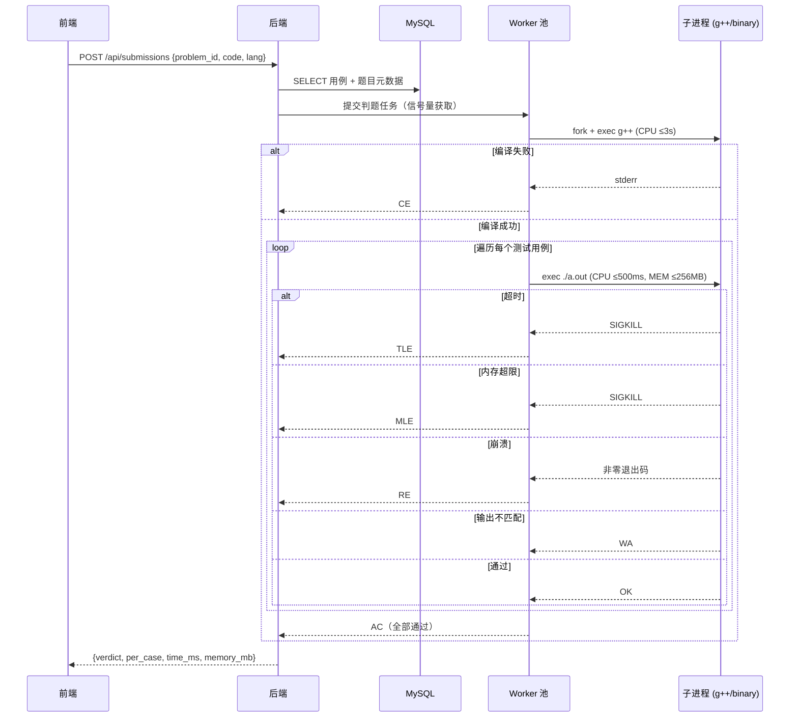
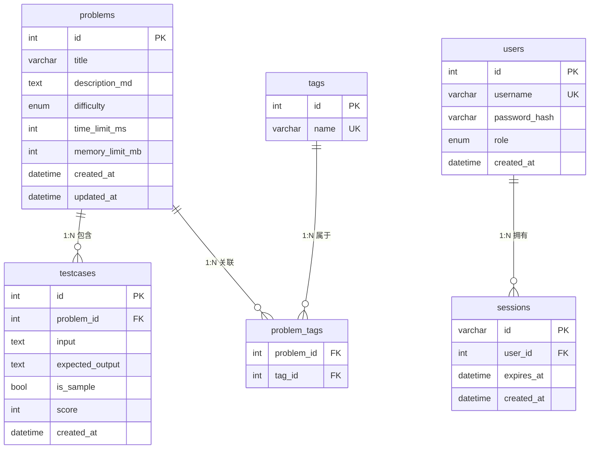
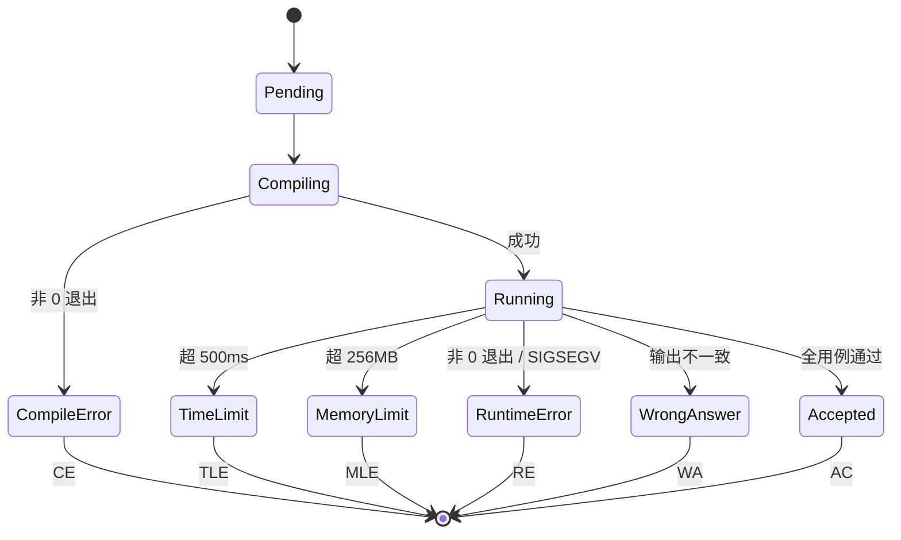

# MiniOJ — 仿 LeetCode 在线判题系统 SPEC

> 项目代号：**MiniOJ**
> 版本：v1.0（初稿）
> 文档状态：规格已冻结（等待验收）

---

## 1. 项目概述

### 1.1 一句话定位
面向**求职展示与教学训练**的轻量级在线判题系统，仿 LeetCode 的核心体验，单实例即可承载 1–40 人并发。

### 1.2 业务目标
- **求职展示**：作为候选人作品集，可一键部署演示。
- **教学训练**：小班/校内场景下刷题、考核的轻量平台。

### 1.3 成功标准（v1.0 收工定义）
- [ ] 执行 `docker compose up -d` 即可启动整套系统
- [ ] 浏览器可访问首页、查看题单、进入题目详情
- [ ] 普通用户可注册、登录、提交 C/C++ 代码并收到 AC/WA/TLE/CE/MLE/RE 结果
- [ ] 管理员登录后可对题目进行增删改查，并可一键重置题库
- [ ] 同时 8 个并发提交不出现崩溃或资源耗尽

---

## 2. 用户与角色

| 角色 | 登录 | 能力 |
|------|------|------|
| 匿名用户 | 不需要 | 浏览题单、查看题目详情、提交代码并查看结果 |
| 普通用户 | 需要（注册 + Session + Cookie） | 同匿名用户（不持久化提交记录，但可在前端展示"已登录"标识） |
| 管理员 | 需要（Session + Cookie） | 全部普通用户能力 + 后台 CRUD + 重置题库 |

> 设计权衡：
> - 管理员账号在首次启动时由 seed 脚本写入数据库（用户名 `admin`，随机密码输出到日志）。
> - 普通用户走自助注册流程：填写用户名 + 密码 → 后端校验唯一性 → bcrypt 加密入库 → 自动登录态。
> - 注册仅做"账号创建"，不收集邮箱/手机号，最大限度降低外部摩擦。

---

## 3. 技术栈

| 层 | 选型 | 理由 |
|----|------|------|
| 后端语言 | C++17 | 用户指定 |
| HTTP 框架 | cpp-httplib（header-only） | 用户指定；零依赖、易部署 |
| 数据库 | MySQL 8 | 用户指定；适合结构化题目数据 |
| 前端 | 原生 HTML + CSS + JS | 用户指定；CDN 引入 CodeMirror 6 作为编辑器 |
| 判题执行 | 本机 `fork` + `exec` + `setrlimit` | 用户指定；权衡后不做 seccomp/chroot |
| 构建系统 | CMake + 系统包 / vcpkg | 用户指定 |
| 容器化 | Docker Compose | 用户指定；一键启动 |

---

## 4. 系统架构

### 4.1 整体架构图

```mermaid
graph TB
    User[浏览器用户]
    Admin[管理员]

    subgraph Docker Compose
        Frontend[静态前端<br/>Nginx]
        Backend[C++ 后端<br/>cpp-httplib]
        MySQL[(MySQL 8)]
    end

    subgraph 判题子系统（同机进程内）
        WorkerPool[Worker 池<br/>信号量限制 ≤8]
        Compiler[g++ 编译]
        Runner[Runner<br/>rlimit 沙箱]
    end

    User --> Frontend
    Admin --> Frontend
    Frontend -->|REST| Backend
    Backend <-->|TCP 3306| MySQL
    Backend --> WorkerPool
    WorkerPool --> Compiler
    WorkerPool --> Runner
```

### 4.2 请求流转：判题流程



---

## 5. 数据模型

> 全部表均满足**第一范式（1NF）**：每个字段原子不可再分、不存在重复组。测试用例、标签等"一对多/多对多"属性全部拆为单独表，通过外键与题目关联。

### 5.1 ER 图



### 5.2 表关系说明

| 关系 | 类型 | 关联方式 |
|------|------|----------|
| `problems` — `testcases` | **1 : N** | 一道题包含多个测试用例，`testcases.problem_id` 外键引用 `problems.id` |
| `problems` — `tags` | **M : N** | 通过中间表 `problem_tags`（`problem_id` + `tag_id`）拆解 |
| `users` — `sessions` | 1 : N | 一个用户可有多端 Session（可选，MVP 可只保留一条） |

### 5.3 字段说明

**problems**
- `difficulty`：`easy | medium | hard`
- `time_limit_ms` / `memory_limit_mb`：判题资源限制（与判题子系统 § 8.1 对齐）

**testcases（1:N 独立表）**
- `problem_id`：FK → `problems.id`，级联删除
- `input` / `expected_output`：TEXT，存原始字符串（含换行）
- `is_sample`：true 时随题目详情返回给前端展示；false 时仅服务端判题用
- `score`：单用例分值（可选用，MVP 不强制要求总分计算）
- 索引：`(problem_id, id)`，按题目拉取全部用例时走索引扫描

**tags**
- `name`：唯一，如 `"数组"`、`"双指针"`
- 通过 `problem_tags` 联合主键 `(problem_id, tag_id)` 保证不重复关联

**users**
- `role`：`admin | user`
- `password_hash`：bcrypt

**sessions**（可选表；如改用 JWT + 无状态可省略）
- `id`：随机 32 字节 hex，作为 Cookie 值
- `expires_at`：TTL，到期由后端惰性清理

### 5.4 1NF 规范化决策
- **不再使用 JSON 数组字段**：原 `problems.tags` JSON 数组违反 1NF（字段非原子 + 重复组），已拆为 `tags` + `problem_tags` 两表，可按标签筛选、做 JOIN、统计。
- **测试用例必为单独表**：题目与用例是典型 1:N，用例数量大且需要独立 CRUD、级联删除，不能内嵌到 `problems` 行内。
- **可扩展性**：未来若加"题目分类 / 难度档位 / 出题人"等维度，均按 1NF 拆表，不在 `problems` 上堆 JSON。

### 5.5 不持久化的内容
- 用户提交的代码（仅在内存中流转）
- 提交记录（每次提交的结果只在 HTTP 响应中返回）

---

## 6. API 设计

所有接口统一返回 JSON。基础前缀：`/api`。

### 6.1 公开接口

| 方法 | 路径 | 说明 | 鉴权 |
|------|------|------|------|
| GET | `/api/problems` | 题单（不含 description） | 无 |
| GET | `/api/problems/:id` | 详情（含 description + sample 用例） | 无 |
| POST | `/api/submissions` | 提交判题 | 无 |

#### POST /api/submissions
请求：
```json
{
  "problem_id": 1,
  "lang": "cpp",
  "code": "#include <iostream>\n..."
}
```
响应：
```json
{
  "verdict": "WA",
  "time_ms": 12,
  "memory_mb": 3,
  "compile_output": "",
  "per_case": [
    {"index": 1, "verdict": "AC", "time_ms": 2},
    {"index": 2, "verdict": "WA", "time_ms": 5, "expected": "1 2", "actual": "1 3"}
  ]
}
```
verdict 取值：`AC | WA | TLE | CE | MLE | RE`

### 6.2 用户账号接口

| 方法 | 路径 | 说明 | 鉴权 |
|------|------|------|------|
| POST | `/api/auth/register` | 普通用户注册 | 无 |
| POST | `/api/auth/login` | 普通用户登录，返回 Set-Cookie | 无 |
| POST | `/api/auth/logout` | 普通用户注销 | Session |
| GET | `/api/auth/me` | 获取当前登录用户信息 | Session |

#### POST /api/auth/register
请求：
```json
{
  "username": "alice",
  "password": "Passw0rd!"
}
```
响应（成功）：
```json
{
  "id": 2,
  "username": "alice",
  "role": "user"
}
```
响应（失败）：
- `400` 参数缺失 / 校验失败（用户名长度、密码强度）
- `409` 用户名已存在

**校验规则**：
- `username`：3–20 位，仅允许字母/数字/下划线，唯一
- `password`：8–64 位，至少包含字母与数字
- 后端 bcrypt 加密后写入 `users` 表，`role='user'`
- 注册成功自动建立 Session（等价于登录），返回 `Set-Cookie`

### 6.3 管理员接口（Session + Cookie 鉴权）

| 方法 | 路径 | 说明 |
|------|------|------|
| POST | `/api/admin/login` | 登录，返回 Set-Cookie |
| POST | `/api/admin/logout` | 注销 |
| GET | `/api/admin/problems` | 题单（含完整数据） |
| POST | `/api/admin/problems` | 新建题目 |
| GET | `/api/admin/problems/:id` | 详情（含全部用例） |
| PUT | `/api/admin/problems/:id` | 更新题目 |
| DELETE | `/api/admin/problems/:id` | 删除题目 |
| POST | `/api/admin/testcases` | 新增用例 |
| PUT | `/api/admin/testcases/:id` | 更新用例 |
| DELETE | `/api/admin/testcases/:id` | 删除用例 |
| POST | `/api/admin/reset` | 重置题库为 seed 数据 |

---

## 7. 前端页面

### 7.1 页面清单

| 路径 | 页面 | 说明 |
|------|------|------|
| `/` | 题目列表页 | 卡片网格，按难度/标签筛选 |
| `/problem/:id` | 题目详情页 | 左描述、右代码、下结果 |
| `/login` | 登录页 | 普通用户登录（账号 + 密码） |
| `/register` | 注册页 | 普通用户注册（账号 + 密码 + 确认密码） |
| `/admin/login` | 后台登录 | 管理员账号密码 |
| `/admin` | 后台管理页 | 题库 CRUD 表格 + 重置按钮 |
| `/admin/edit/:id` | 题目编辑 | 描述 / 用例表单 |

### 7.2 注册页 `/register`

```
┌──────────────────────────────────────────────────────────────┐
│  Header: Logo  |  题单  |  登录入口                          │
├──────────────────────────────────────────────────────────────┤
│                                                              │
│             ┌────────────────────────────┐                  │
│             │   注 册 账 号              │                  │
│             │                            │                  │
│             │   用户名: [_____________]  │                  │
│             │   密  码: [_____________]  │                  │
│             │   确认密码: [____________] │                  │
│             │                            │                  │
│             │   [   注  册   ]           │                  │
│             │                            │                  │
│             │   已有账号？前往登录        │                  │
│             └────────────────────────────┘                  │
│                                                              │
└──────────────────────────────────────────────────────────────┘
```

**交互流程**：
1. 实时校验：用户名格式、密码强度、两次密码一致性
2. 提交 `POST /api/auth/register`
3. 成功 → 自动登录（Set-Cookie）→ 跳转 `/`
4. 失败 → 表单内联显示错误（用户名已存在 / 参数不合法）
5. 注册按钮 loading 态防重复提交

### 7.3 登录页 `/login`

```
┌──────────────────────────────────────────────────────────────┐
│  Header: Logo  |  题单  |  注册入口                          │
├──────────────────────────────────────────────────────────────┤
│             ┌────────────────────────────┐                  │
│             │   登 录                    │                  │
│             │                            │                  │
│             │   用户名: [_____________]  │                  │
│             │   密  码: [_____________]  │                  │
│             │                            │                  │
│             │   [   登  录   ]           │                  │
│             │                            │                  │
│             │   还没有账号？立即注册      │                  │
│             │   管理员入口 →             │                  │
│             └────────────────────────────┘                  │
└──────────────────────────────────────────────────────────────┘
```

**交互流程**：
1. 提交 `POST /api/auth/login`
2. 成功 → 写入 `Set-Cookie` → 跳转 `/`
3. 失败 → 显示错误提示（用户名或密码错误）
4. Header 根据登录态切换：未登录显示"登录 / 注册"；已登录显示"用户名 ▾ (退出)"

### 7.4 题目详情页布局（仿 LeetCode）

```
┌──────────────────────────────────────────────────────────────┐
│  Header: Logo  |  题单  |  登录/用户名                       │
├──────────────────────────┬───────────────────────────────────┤
│                          │  语言: [C++ ▾]   模板: [加载]      │
│   题目描述 (Markdown)     ├───────────────────────────────────┤
│                          │                                   │
│   - 描述                   │   CodeMirror 6 编辑器              │
│   - 样例输入/输出         │   (语法高亮、自动缩进)              │
│   - 提示                   │                                   │
│                          │                                   │
│                          │   [提交]  [重置]                   │
├──────────────────────────┴───────────────────────────────────┤
│  判题结果: WA (第 2/5 用例)                                   │
│  - Case 1: AC (2ms)                                          │
│  - Case 2: WA — Expected "1 2" / Got "1 3"                    │
│  ...                                                           │
└──────────────────────────────────────────────────────────────┘
```

### 7.5 视觉风格
- 暗色主题（背景 `#1a1a1a`、卡片 `#262626`、主色 `#ffa116` 仿 LeetCode 橙）
- 卡片化题单，难度徽章着色
- 响应式适配桌面优先

---

## 8. 判题机制

### 8.1 资源限制（rlimit）

| 资源 | 限制 |
|------|------|
| 单用例 CPU 时间 | ≤ 500 ms（超出 TLE） |
| 单次提交总 CPU 时间（含所有用例） | ≤ 2 s（隐含上限） |
| 编译时间 | ≤ 3 s（超出 CE） |
| 内存 | ≤ 256 MB（超出 MLE） |
| 输出 | ≤ 16 MB（防止刷盘） |
| 子进程数 | ≤ 8（信号量控制，并发任务上限） |
| 文件大小 | 临时目录 ≤ 10 MB |

### 8.2 判题状态机



### 8.3 并发控制
- 使用 `std::counting_semaphore<8>` 或 `std::mutex + std::condition_variable` 实现信号量
- 超出并发上限的提交进入内存队列，按 FIFO 调度
- 子进程清理采用 `SIGCHLD` + `waitpid` 非阻塞回收，避免僵尸进程

### 8.4 安全策略（已知权衡）
**只采用 rlimit，不做 seccomp / chroot / setuid**。
- **风险**：恶意代码可调用 `fork` / `execve` / 写文件 / 联网。
- **缓解**：因系统面向"求职展示 + 教学训练"，用户基本可信；管理员只允许内网访问。
- **不做 seccomp 的理由**：增加复杂度与兼容性负担；MVP 优先级。
- **未来**：若对外开放，需迁移到 Docker 或 nsjail。

---

## 9. 部署

### 9.1 Docker Compose 服务清单

| 服务 | 镜像 | 端口 | 说明 |
|------|------|------|------|
| `mysql` | `mysql:8.0` | 3306（仅内网） | 持久化数据卷 |
| `backend` | 本地构建 `minioj-backend` | 8080 | C++ 二进制 |
| `frontend` | `nginx:alpine` | 80 | 反向代理 + 静态文件 |
| `seed` | 本地构建（一次性） | - | 首次启动初始化题库与管理员 |

### 9.2 启动流程

```bash
docker compose up -d          # 启动 mysql + backend + frontend
docker compose run --rm seed  # 首次执行：建表 + 写入 seed 题目 + 创建 admin
# 访问 http://localhost
# 管理员账号: admin / (启动时由 seed 生成的随机密码，输出到日志)
```

### 9.3 目录结构

```
minioj/
├── docker-compose.yml
├── README.md
├── backend/
│   ├── CMakeLists.txt
│   ├── Dockerfile
│   ├── third_party/         # cpp-httplib 单头
│   ├── src/
│   │   ├── main.cpp
│   │   ├── http/            # 路由与中间件
│   │   ├── db/              # MySQL 连接池与 DAO
│   │   ├── judge/           # 判题核心 (worker/compile/run)
│   │   ├── auth/            # Session + bcrypt
│   │   └── util/            # 配置、日志、信号处理
│   ├── seed/
│   │   └── problems.json    # 内置题目
│   └── scripts/
│       └── seed.cpp
└── frontend/
    ├── Dockerfile
    ├── nginx.conf
    └── public/
        ├── index.html          # 题目列表页
        ├── problem.html        # 题目详情页
        ├── login.html          # 普通用户登录页
        ├── register.html       # 普通用户注册页
        ├── admin/
        │   ├── login.html      # 管理员登录页
        │   ├── index.html      # 后台管理页
        │   └── edit.html       # 题目编辑页
        ├── css/
        ├── js/
        │   ├── api.js          # API 封装（含 token / cookie 处理）
        │   ├── auth.js         # 登录态读写 & Header 切换
        │   └── ...
        └── assets/
```

---

## 10. TODO 清单（分阶段）

### Phase 0：脚手架
- [ ] 仓库结构与 README 草案
- [ ] `docker-compose.yml` 骨架
- [ ] backend `CMakeLists.txt` + cpp-httplib 接入
- [ ] frontend 静态页骨架（首页 + 题目页占位）
- [ ] **MySQL 建表 DDL**：`problems` / `testcases`（1:N）/ `tags` / `problem_tags` / `users` / `sessions`，全部符合 1NF，含索引与外键级联策略

### Phase 1：基础 HTTP 与题单展示
- [ ] 后端：`/api/problems`、`/api/problems/:id` 实现
- [ ] 前端：首页题单卡片渲染
- [ ] 前端：题目详情 Markdown 渲染（marked.js CDN）

### Phase 2：用户账号体系（注册 / 登录 / 注销）
- [ ] 后端：`POST /api/auth/register`（参数校验 + 唯一性 + bcrypt 落库 + 自动登录）
- [ ] 后端：`POST /api/auth/login`（bcrypt 校验 + Session 写入 + Set-Cookie）
- [ ] 后端：`POST /api/auth/logout`（清除 Session）
- [ ] 后端：`GET /api/auth/me`（返回当前登录用户）
- [ ] 前端：注册页 `register.html`（表单 + 实时校验 + 内联错误提示）
- [ ] 前端：登录页 `login.html`（与注册页互链）
- [ ] 前端：Header 登录态切换（未登录显登录/注册；已登录显用户名+退出）
- [ ] `users` 表索引：username 唯一索引

### Phase 3：判题核心
- [ ] worker 池（信号量）
- [ ] 编译子进程（g++，3s 超时）
- [ ] 运行子进程（rlimit：CPU/内存/输出）
- [ ] 状态判定（AC/WA/TLE/CE/MLE/RE）
- [ ] `/api/submissions` 端到端打通

### Phase 4：前端编辑器与判题结果
- [ ] CodeMirror 6 接入 + 模板加载
- [ ] 提交按钮 + 结果面板渲染
- [ ] 用例详情（WA 时显示 expected/actual）

### Phase 5：管理员后台
- [ ] 登录接口（bcrypt + Session）
- [ ] 后台页面：题单 CRUD
- [ ] 题目编辑页（含用例管理）
- [ ] 一键重置接口

### Phase 6：打磨与部署
- [ ] Dockerfile（backend / frontend）
- [ ] seed 脚本与初始题库（含 admin 默认账号）
- [ ] README 一键启动文档（含注册流程说明）
- [ ] 端到端冒烟测试（注册→登录→刷题 5 道内置题）

---

## 11. 验收标准

### 11.1 功能验收
- [ ] 启动后 5 分钟内可访问首页
- [ ] 题单显示至少 5 道内置题
- [ ] 题目页可正常加载、编辑、提交
- [ ] 内置题目的正确解法提交后返回 `AC`
- [ ] 错误解法返回 `WA` 且显示 expected/actual
- [ ] 死循环代码 ≤500ms 后返回 `TLE`
- [ ] 申请大数组代码 ≤256MB 后返回 `MLE`
- [ ] 语法错误代码返回 `CE` 且显示 stderr
- [ ] 管理员登录后可创建/编辑/删除题目
- [ ] 管理员一键重置后题库回到 seed 状态
- [ ] **注册页可用**：合法用户名+密码注册成功后自动登录并跳转首页
- [ ] **注册校验生效**：用户名重复返回 409；密码过短返回 400
- [ ] **登录页可用**：已注册账号可登录并写入 Session
- [ ] **登录态显示**：Header 在已登录时展示用户名与退出按钮

### 11.2 非功能验收
- [ ] 8 个并发提交全部正常返回，无僵尸进程
- [ ] MySQL 连接池稳定，无泄漏
- [ ] 前端首屏 ≤ 1s（本地）
- [ ] 判题同步响应 ≤ 2s（单用例）

### 11.3 部署验收
- [ ] `docker compose up -d` 一键启动成功
- [ ] README 含完整启动步骤与默认账号
- [ ] `docker compose down -v` 后重新启动可恢复初始状态

---

## 12. 风险与权衡

| 决策 | 替代方案 | 风险 | 取舍理由 |
|------|----------|------|----------|
| 本机 fork+exec | Docker / nsjail | 恶意代码可访问本机 | 用户为可信场景（教学 + 展示） |
| 仅 C/C++ | 多语言 | 用户群体受限 | 求职主场景 + 简化构建 |
| 仅 rlimit | seccomp / chroot | 沙箱强度弱 | MVP 优先控制复杂度 |
| 提交不持久化 | 存数据库 | 无法回看历史 | 简化数据模型，降低成本 |
| 普通用户匿名 | 强制注册 | 无法按人统计 | 改为"可选注册"，保留匿名浏览/提交，注册后展示登录态 |
| MySQL | SQLite | 部署需额外服务 | 用户指定 |
| Docker Compose | k8s / systemd | 扩展性差 | 1-40 人无需 |

---

## 13. 未来扩展（v2.x 预留）

- 多语言支持（Python / Java / Go）
- 提交记录持久化与个人中心（注册账号后关联提交历史）
- 难度筛选、标签筛选、关键词搜索
- 竞赛模式与排行榜
- 迁移到 nsjail / firejail 强化沙箱
- WebSocket 实时流式输出编译日志
- 题目批量导入（ZIP + 标准格式）
