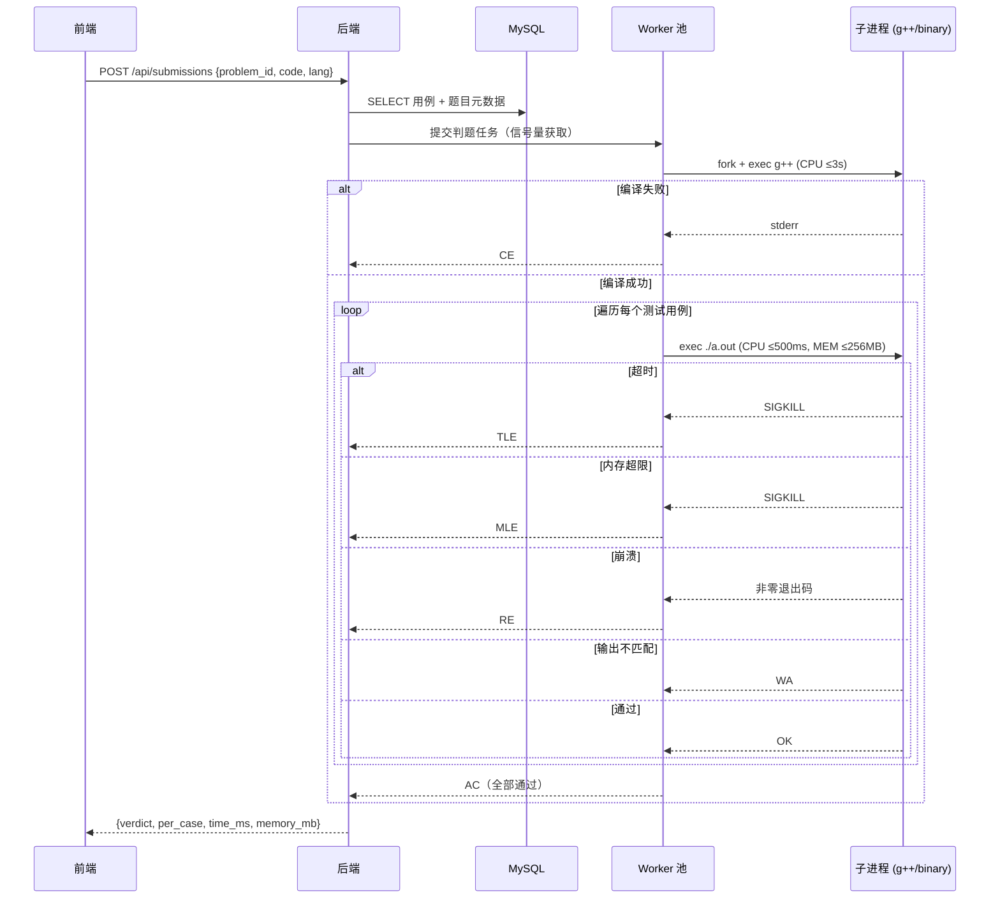
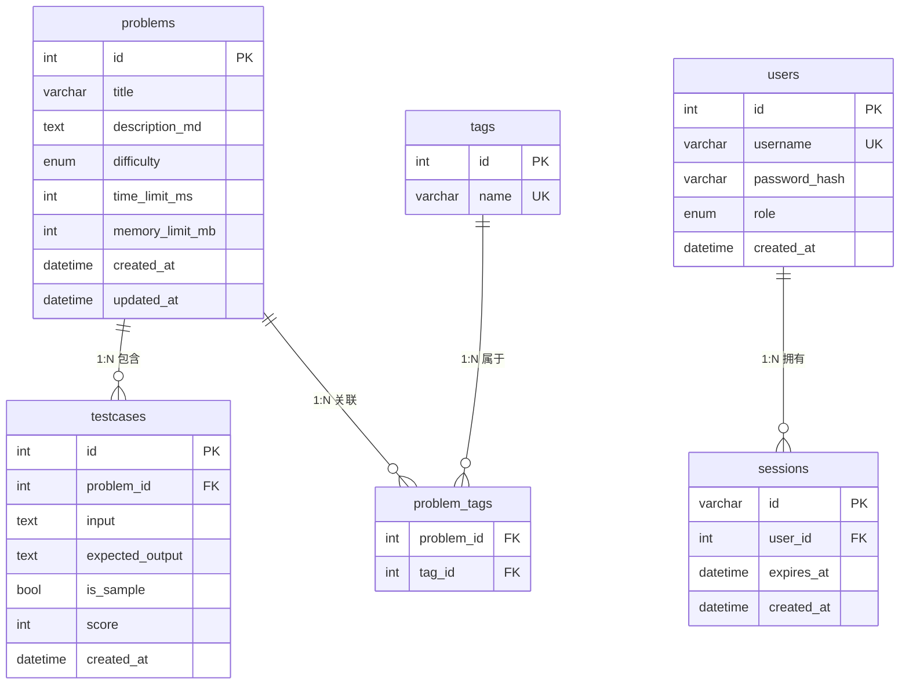
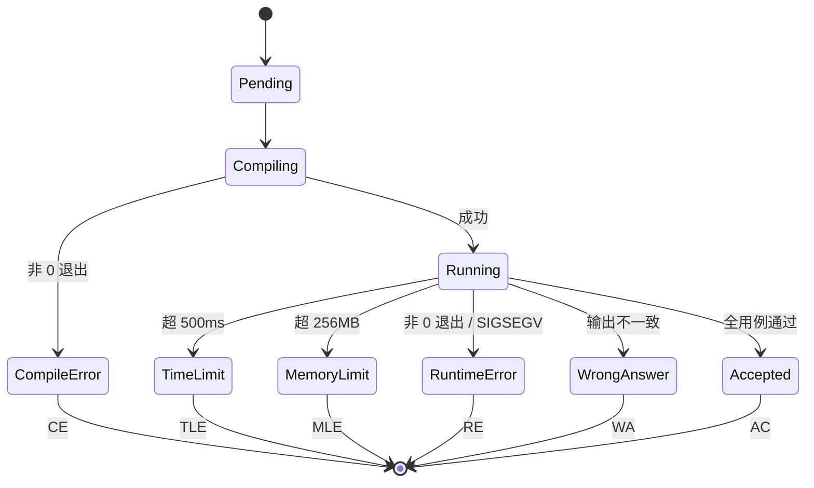

# MiniOJ — 仿 LeetCode 在线判题系统 SPEC

> 项目代号：**MiniOJ**
> 版本：v1.2（在 v1.1 基础上新增 2GB 内存部署适配 + 自动化测试就绪态工具）
> 文档状态：v1.2 已落地；v1.0 / v1.1 全部 `[x]`；§11.3 部署 E2E 已通过

---

## 1. 项目概述

### 1.1 一句话定位
面向**算法训练与刷题练习**的轻量级在线判题系统，仿 LeetCode 的核心体验，单实例即可承载 1–40 人并发。

### 1.2 业务目标
- **算法训练**：面向刷题人群（自学 / 求职备考 / 校队训练），提供 LeetCode 风格的题单 + 编辑器 + 即时评测。
- **教学训练**：小班/校内场景下刷题、考核的轻量平台。

### 1.3 成功标准（v1.0 收工定义）
- [x] **裸机路径**：按 `docs/DEPLOY_NATIVE.md` 在 Ubuntu 22.04+ 上无需容器直接拉起
- [x] 浏览器可访问首页、查看题单、进入题目详情
- [x] 普通用户可注册、登录、提交 C/C++ 代码并收到 AC/WA/TLE/CE/MLE/RE 结果
- [x] 管理员登录后可对题目进行增删改查，并可一键重置题库
- [x] 同时 8 个并发提交不出现崩溃或资源耗尽

> **部署形态**：本项目**裸机原生部署**，详见 [`docs/DEPLOY_NATIVE.md`](./docs/DEPLOY_NATIVE.md)。Ubuntu/Debian 系统包（MySQL 8 + Nginx）+ 自编译后端 + nginx 反代 `/api/*`。所有依赖走系统包，零容器运行时依赖。

---

## 2. 用户与角色

| 角色 | 登录 | 能力 |
|------|------|------|
| 匿名用户 | 不需要 | 浏览题单、查看题目详情、提交代码并查看结果 |
| 普通用户 | 需要（注册 + Session + Cookie） | 同匿名用户（不持久化提交记录，但可在前端展示"已登录"标识） |
| 管理员 | 需要（Session + Cookie） | 全部普通用户能力 + 后台 CRUD + 重置题库 |

> 设计权衡：
> - 管理员账号在首次启动时由 seed 脚本写入数据库（用户名 `admin`，随机密码输出到日志）。
> - 普通用户走自助注册流程：填写用户名 + 密码 → 后端校验唯一性 → bcrypt 加密入库 → 自动登录态。
> - 注册仅做"账号创建"，不收集邮箱/手机号，最大限度降低外部摩擦。

---

## 3. 技术栈

| 层 | 选型 | 理由 |
|----|------|------|
| 后端语言 | C++17 | 用户指定 |
| HTTP 框架 | cpp-httplib（header-only） | 用户指定；零依赖、易部署 |
| 数据库 | MySQL 8 | 用户指定；适合结构化题目数据 |
| 前端 | 原生 HTML + CSS + JS | 用户指定；CDN 引入 CodeMirror 6 作为编辑器 |
| 判题执行 | 本机 `fork` + `exec` + `setrlimit` | 用户指定；权衡后不做 seccomp/chroot |
| 构建系统 | CMake + 系统包 / vcpkg | 用户指定 |
| 部署 | 裸机原生（Ubuntu + 系统 MySQL + nginx + 自编译后端） | 详见 `docs/DEPLOY_NATIVE.md` |

---

## 4. 系统架构

### 4.1 整体架构图

```mermaid
graph TB
    User[浏览器用户]
    Admin[管理员]

    subgraph 裸机原生部署（docs/DEPLOY_NATIVE.md）
        Nginx[系统 nginx :80<br/>静态文件 + /api/* 反代]
        Binary[自编译 minioj-backend<br/>:8080]
        MysqlSys[(系统 MySQL 8<br/>:3306)]
        Nginx -->|反代 /api/*| Binary
        Binary --> MysqlSys
    end

    subgraph 判题子系统（同机进程内）
        WorkerPool[Worker 池<br/>信号量限制 ≤8]
        Compiler[g++ 编译]
        Runner[Runner<br/>rlimit 沙箱]
    end

    User --> Nginx
    Admin --> Nginx
    Binary --> WorkerPool
    WorkerPool --> Compiler
    WorkerPool --> Runner
```

### 4.2 请求流转：判题流程



---

## 5. 数据模型

> 全部表均满足**第一范式（1NF）**：每个字段原子不可再分、不存在重复组。测试用例、标签等"一对多/多对多"属性全部拆为单独表，通过外键与题目关联。

### 5.1 ER 图



### 5.2 表关系说明

| 关系 | 类型 | 关联方式 |
|------|------|----------|
| `problems` — `testcases` | **1 : N** | 一道题包含多个测试用例，`testcases.problem_id` 外键引用 `problems.id` |
| `problems` — `tags` | **M : N** | 通过中间表 `problem_tags`（`problem_id` + `tag_id`）拆解 |
| `users` — `sessions` | 1 : N | 一个用户可有多端 Session（可选，MVP 可只保留一条） |

### 5.3 字段说明

**problems**
- `difficulty`：`easy | medium | hard`
- `time_limit_ms` / `memory_limit_mb`：判题资源限制（与判题子系统 § 8.1 对齐）

**testcases（1:N 独立表）**
- `problem_id`：FK → `problems.id`，级联删除
- `input` / `expected_output`：TEXT，存原始字符串（含换行）
- `is_sample`：true 时随题目详情返回给前端展示；false 时仅服务端判题用
- `score`：单用例分值（可选用，MVP 不强制要求总分计算）
- 索引：`(problem_id, id)`，按题目拉取全部用例时走索引扫描

**tags**
- `name`：唯一，如 `"数组"`、`"双指针"`
- 通过 `problem_tags` 联合主键 `(problem_id, tag_id)` 保证不重复关联

**users**
- `role`：`admin | user`
- `password_hash`：bcrypt

**sessions**（可选表；如改用 JWT + 无状态可省略）
- `id`：随机 32 字节 hex，作为 Cookie 值
- `expires_at`：TTL，到期由后端惰性清理

### 5.4 1NF 规范化决策
- **不再使用 JSON 数组字段**：原 `problems.tags` JSON 数组违反 1NF（字段非原子 + 重复组），已拆为 `tags` + `problem_tags` 两表，可按标签筛选、做 JOIN、统计。
- **测试用例必为单独表**：题目与用例是典型 1:N，用例数量大且需要独立 CRUD、级联删除，不能内嵌到 `problems` 行内。
- **可扩展性**：未来若加"题目分类 / 难度档位 / 出题人"等维度，均按 1NF 拆表，不在 `problems` 上堆 JSON。

### 5.5 不持久化的内容
- 用户提交的代码（仅在内存中流转）
- 提交记录（每次提交的结果只在 HTTP 响应中返回）

---

## 6. API 设计

所有接口统一返回 JSON。基础前缀：`/api`。

### 6.1 公开接口

| 方法 | 路径 | 说明 | 鉴权 |
|------|------|------|------|
| GET | `/api/problems` | 题单（不含 description） | 无 |
| GET | `/api/problems/:id` | 详情（含 description + sample 用例） | 无 |
| POST | `/api/submissions` | 提交判题 | 无 |

#### POST /api/submissions
请求：
```json
{
  "problem_id": 1,
  "lang": "cpp",
  "code": "#include <iostream>\n..."
}
```
响应：
```json
{
  "verdict": "WA",
  "time_ms": 12,
  "memory_mb": 3,
  "compile_output": "",
  "per_case": [
    {"index": 1, "verdict": "AC",  "time_ms": 2,  "memory_mb": 2},
    {"index": 2, "verdict": "WA",  "time_ms": 5,  "memory_mb": 2,
     "expected": "1 2", "actual": "1 3"}
  ]
}
```
verdict 取值：`AC | WA | TLE | CE | MLE | RE`

> `per_case[]` 元素统一带 `time_ms` 与 `memory_mb`；**仅当 `verdict == "WA"` 时**附 `expected` / `actual` 两字段。

### 6.2 用户账号接口

| 方法 | 路径 | 说明 | 鉴权 |
|------|------|------|------|
| POST | `/api/auth/register` | 普通用户注册（自动登录） | 无 |
| POST | `/api/auth/login` | 普通用户 / 管理员登录，返回 Set-Cookie | 无 |
| POST | `/api/auth/logout` | 注销（普通用户、管理员共用） | Session |
| GET | `/api/auth/me` | 获取当前登录用户信息（含 role） | Session |

> Cookie 名：`minioj_sid`（见 `backend/src/auth/session.hpp`）。

#### POST /api/auth/register
请求：
```json
{
  "username": "alice",
  "password": "Passw0rd!"
}
```
响应（成功，201）：
```json
{
  "id": 2,
  "username": "alice",
  "role": "user"
}
```
响应（失败）：
- `400` 参数缺失 / 校验失败（用户名长度、字符集、密码长度、密码强度）
- `409` 用户名已存在
副作用：成功后写入 `Set-Cookie: minioj_sid=...`，等价于已登录。

**校验规则**：
- `username`：3–20 位，仅允许字母/数字/下划线，唯一
- `password`：8–64 位，至少包含字母与数字
- 后端 bcrypt 加密后写入 `users` 表，`role='user'`

#### POST /api/auth/login
请求：
```json
{
  "username": "alice",
  "password": "Passw0rd!"
}
```
响应（成功，200）：
```json
{
  "id": 2,
  "username": "alice",
  "role": "user"
}
```
> `role` 取值 `user` 或 `admin`；管理员账号也走此端点登录，靠后续 role 中间件拦截非 admin 访问管理接口。

响应（失败）：
- `400` 缺 `username` / `password` 字段或非字符串
- `401` 用户名或密码错误（**统一文案**，防账号枚举）

#### POST /api/auth/logout
请求体可为空。响应（200）：
```json
{ "status": "ok" }
```
副作用：清空 `minioj_sid` Cookie + 删除 DB session 行；幂等（未登录调用也返 200）。

#### GET /api/auth/me
响应（200，已登录）：
```json
{ "id": 2, "username": "alice", "role": "user" }
```
响应（401，未登录 / Session 过期）：
```json
{ "error": "not logged in" }
```
或
```json
{ "error": "session expired or invalid" }
```

### 6.3 管理员接口（Session + Cookie + role=admin 鉴权）

| 方法 | 路径 | 说明 |
|------|------|------|
| GET | `/api/admin/problems` | 题单（含 description） |
| POST | `/api/admin/problems` | 新建题目（含 tags + testcases 事务级 upsert） |
| GET | `/api/admin/problems/:id` | 详情（含全部 testcases） |
| PUT | `/api/admin/problems/:id` | 更新题目（testcases **整组替换**） |
| DELETE | `/api/admin/problems/:id` | 删除题目（级联删除 testcases） |
| POST | `/api/admin/reset` | 一键重置题库为 seed 数据 |

#### 鉴权与口径（v1 收敛）

- **登录复用**：`/api/admin/login` **不独立提供**。管理员账号通过 `POST /api/auth/login` 登录，`role='admin'` 由 seed 写入；注销也走 `/api/auth/logout`。
- **role 中间件**：`/api/admin/*` 路由层挂 role 校验中间件，未登录返 `401`、非 admin 返 `403`。
- **用例管理**：不提供单独的 `POST/PUT/DELETE /api/admin/testcases[/:id]` 端点——用例由 `POST/PUT /api/admin/problems` 在事务内**整组 upsert**（先删后插）覆盖。1NF 仍由 `testcases` 独立表承担（参见 § 5.1）。
- **重置接口**：v1 必做，配套 seed 进程（参见 § 9.1 / § 10 Phase 6）。

#### POST /api/admin/problems
请求体：
```json
{
  "title": "两数之和",
  "description_md": "给定两个整数 a, b...",
  "difficulty": "easy",
  "time_limit_ms": 500,
  "memory_limit_mb": 256,
  "tags": ["数组", "哈希表"],
  "testcases": [
    {"input": "1 2\n",  "expected_output": "3\n", "is_sample": true,  "score": 50},
    {"input": "5 7\n",  "expected_output": "12\n","is_sample": false, "score": 50}
  ]
}
```
- `difficulty` 取值：`easy | medium | hard`（**小写**）
- `time_limit_ms` / `memory_limit_mb` 必须 > 0
- `testcases` 1–1000 项，每项 `input` / `expected_output` 必填，`is_sample` / `score` 可选
- 响应：`201 {"id": <new_id>, "message": "problem created"}`

#### DELETE /api/admin/problems/:id
- 删除成功：`204` 空 body
- ID 非数字：`400 {"error":"invalid problem id"}`
- 不存在：`404 {"error":"problem not found"}`

---

## 7. 前端页面

### 7.1 页面清单

| 路径 | 页面 | 说明 |
|------|------|------|
| `/` | **大屏落地页** | Hero（标语 + 终端装饰 + CTA）+ Features + How it works + CTA Banner + Footer |
| `/problems.html` | 题目列表页 | 卡片网格，按难度/标签筛选（原 `/`，v1.1 起迁出） |
| `/problem/:id` | 题目详情页 | 左描述、右代码、下结果 |
| `/login` | 登录页 | 普通用户登录（账号 + 密码） |
| `/register` | 注册页 | 普通用户注册（账号 + 密码 + 确认密码） |
| `/admin/login` | 后台登录 | 管理员账号密码（复用 `/api/auth/login`，靠 role 中间件拦截） |
| `/admin` | 后台管理页 | 题库 CRUD 表格 + 重置按钮 |
| `/admin/edit/:id` | 题目编辑 | 描述 / 用例表单 |

> **v1.1 变更**：原 `/` 题单页迁出为 `/problems.html`，`/` 改为产品落地页（**刷题导向主入口**）。落地页含动态装饰（打字机 + 实时判评状态轮播），设计原则参见 § 7.5。
>
> **v1.x 微调**：落地页删除了 Stats 与 Preview（精选题目卡片 + 标签胶囊）两节，Hero 区移除了 CPU/内存/并发等技术指标 — 全部内容聚焦"刷题体验"，面向刷题人群而非部署运维视角。

### 7.2 注册页 `/register`

```
┌──────────────────────────────────────────────────────────────┐
│  Header: Logo  |  题单  |  登录入口                          │
├──────────────────────────────────────────────────────────────┤
│                                                              │
│             ┌────────────────────────────┐                  │
│             │   注 册 账 号              │                  │
│             │                            │                  │
│             │   用户名: [_____________]  │                  │
│             │   密  码: [_____________]  │                  │
│             │   确认密码: [____________] │                  │
│             │                            │                  │
│             │   [   注  册   ]           │                  │
│             │                            │                  │
│             │   已有账号？前往登录        │                  │
│             └────────────────────────────┘                  │
│                                                              │
└──────────────────────────────────────────────────────────────┘
```

**交互流程**：
1. 实时校验：用户名格式、密码强度、两次密码一致性
2. 提交 `POST /api/auth/register`
3. 成功 → 自动登录（Set-Cookie）→ 跳转 `/problems.html`
4. 失败 → 表单内联显示错误（用户名已存在 / 参数不合法）
5. 注册按钮 loading 态防重复提交

### 7.3 登录页 `/login`

```
┌──────────────────────────────────────────────────────────────┐
│  Header: Logo  |  题单  |  注册入口                          │
├──────────────────────────────────────────────────────────────┤
│             ┌────────────────────────────┐                  │
│             │   登 录                    │                  │
│             │                            │                  │
│             │   用户名: [_____________]  │                  │
│             │   密  码: [_____________]  │                  │
│             │                            │                  │
│             │   [   登  录   ]           │                  │
│             │                            │                  │
│             │   还没有账号？立即注册      │                  │
│             │   管理员入口 →             │                  │
│             └────────────────────────────┘                  │
└──────────────────────────────────────────────────────────────┘
```

**交互流程**：
1. 提交 `POST /api/auth/login`
2. 成功 → 写入 `Set-Cookie` → 跳转 `/problems.html`
3. 失败 → 显示错误提示（用户名或密码错误）
4. Header 根据登录态切换：未登录显示"登录 / 注册"；已登录显示"用户名 ▾ (退出)"

### 7.4 题目详情页布局（仿 LeetCode）

```
┌──────────────────────────────────────────────────────────────┐
│  Header: Logo  |  题单  |  登录/用户名                       │
├──────────────────────────┬───────────────────────────────────┤
│                          │  语言: [C++ ▾]   模板: [加载]      │
│   题目描述 (Markdown)     ├───────────────────────────────────┤
│                          │                                   │
│   - 描述                   │   CodeMirror 6 编辑器              │
│   - 样例输入/输出         │   (语法高亮、自动缩进)              │
│   - 提示                   │                                   │
│                          │                                   │
│                          │   [提交]  [重置]                   │
├──────────────────────────┴───────────────────────────────────┤
│  判题结果: WA (第 2/5 用例)                                   │
│  - Case 1: AC (2ms)                                          │
│  - Case 2: WA — Expected "1 2" / Got "1 3"                    │
│  ...                                                           │
└──────────────────────────────────────────────────────────────┘
```

### 7.5 视觉风格
- 暗色主题（背景 `#1a1a1a`、卡片 `#262626`、主色 `#ffa116` 仿 LeetCode 橙）
- 卡片化题单，难度徽章着色
- 响应式适配桌面优先

> **大屏落地页补充（v1.1 / v1.x）**：
> - 暗色 OLED 风（背景 `#0b0f17`）+ 仿 LeetCode 橙（`#ffa116`）
> - Hero 区：左侧标语 + 标题 + 描述 + 双 CTA；右侧终端框（macOS 三色灯 + 动态打字机 + 实时判评状态条 AC/WA/TLE/CE 循环）。**无技术指标条**（CPU/内存/并发等已移出，面向刷题人群）
> - 网格背景：CSS `linear-gradient` 1px 网格 + 径向 mask 渐隐
> - Features：3 列卡片（**秒回结果 / 逐用例反馈 / 开箱即用的编辑器**），hover 微上浮 + 边框变橙 — 文案从"运维视角"改为"刷题体验视角"
> - How it works：3 步骤卡片 + 步骤编号 + 路径 pill（**挑一道题 → 写下思路 → 看结果，调思路**）
> - CTA Banner：单行文案"来一道题热热身？"+ 双 CTA（开始刷题 / 注册账号）
> - Footer：tagline "专注刷题的轻量级在线评测平台"
> - **已删除**：Stats 4 栏技术指标带、Preview（精选题目 + 难度档位 + 标签胶囊）整段
> - 全部图标：inline SVG（Heroicons 风格），禁止 emoji 当图标
> - `prefers-reduced-motion: reduce` 时停用打字机、徽章呼吸、hover 位移、caret 闪烁等所有动画
> - 响应式断点：1024 / 900 / 768 / 480

---

## 8. 判题机制

### 8.1 资源限制（rlimit）

| 资源 | 限制 |
|------|------|
| 单用例 CPU 时间 | ≤ 500 ms（超出 TLE） |
| 单次提交总 CPU 时间（含所有用例） | ≤ 2 s（隐含上限） |
| 编译时间 | ≤ 3 s（超出 CE） |
| 内存 | ≤ 256 MB（超出 MLE） |
| 输出 | ≤ 16 MB（防止刷盘） |
| 子进程数 | ≤ 8（信号量控制，并发任务上限） |
| 文件大小 | 临时目录 ≤ 10 MB |

### 8.2 判题状态机



### 8.3 并发控制
- 使用 `std::counting_semaphore<8>` 或 `std::mutex + std::condition_variable` 实现信号量
- 超出并发上限的提交进入内存队列，按 FIFO 调度
- 子进程清理采用 `SIGCHLD` + `waitpid` 非阻塞回收，避免僵尸进程

### 8.4 安全策略（已知权衡）
**只采用 rlimit，不做 seccomp / chroot / setuid**。
- **风险**：恶意代码可调用 `fork` / `execve` / 写文件 / 联网。
- **缓解**：因系统面向"算法训练 + 教学训练"，用户基本可信；管理员只允许内网访问。
- **不做 seccomp 的理由**：增加复杂度与兼容性负担；MVP 优先级。
- **未来**：若对外开放，需迁移到 nsjail 或类似的强隔离沙箱。

---

## 9. 部署

本项目采用**裸机原生部署**：Ubuntu/Debian 系统包（MySQL 8 + Nginx）+ 自编译 C++ 后端 + nginx 反代 `/api/*`。完整步骤见 [`docs/DEPLOY_NATIVE.md`](./docs/DEPLOY_NATIVE.md)。

### 9.0 服务清单

| 进程 | 角色 | 端口 | 启动方式 |
|---|---|---|---|
| `mysqld`（系统服务） | 数据库 | 3306（localhost） | `systemctl enable --now mysql` |
| `minioj-backend`（自编译） | HTTP + 判题 | 8080 | `systemd` 或前台 `./build/minioj-backend` |
| `nginx`（系统服务） | 静态文件 + `/api/*` 反代 | **80（唯一对外入口）** | `systemctl enable --now nginx` |

> ⚠️ **端口拓扑要点**：浏览器只能访问 nginx 的 80 端口；后端 8080 与 MySQL 3306 仅监听 localhost。详见 `docs/DEPLOY_NATIVE.md §4 nginx 反代配置`。
>
> 部署到外网时，**只需放行 80 端口**（腾讯云安全组默认仅放 22/3389，需手动添加）。

### 9.1 启动流程

#### 9.1.1 生产 / 远程部署

```bash
# 1. 装系统包（一次性）
sudo apt-get install -y build-essential cmake ninja-build pkg-config \
    g++ default-libmysqlclient-dev libjsoncpp-dev libssl-dev \
    default-mysql-client nginx

# 2. 配 MySQL（一次性）
sudo systemctl enable --now mysql
sudo mysql -uroot <<'SQL'
CREATE DATABASE minioj DEFAULT CHARACTER SET utf8mb4;
CREATE USER 'minioj'@'localhost' IDENTIFIED BY 'change_me';
GRANT ALL ON minioj.* TO 'minioj'@'localhost';
FLUSH PRIVILEGES;
SQL

# 3. 编译 + 灌 schema
cmake -S backend -B backend/build -G Ninja -DCMAKE_BUILD_TYPE=Release
cmake --build backend/build -j
sudo mysql -uminioj -pchange_me minioj < backend/sql/schema.sql

# 4. 灌种子题 + 创建 admin（密码随机写入 stdout）
./backend/build/minioj-seed --reset

# 5. 起后端（systemd / 前台 二选一，详见 docs/DEPLOY_NATIVE.md §3）
HTTP_HOST=127.0.0.1 HTTP_PORT=8080 \
DB_HOST=127.0.0.1 DB_PORT=3306 DB_NAME=minioj \
DB_USER=minioj DB_PASSWORD=change_me \
./backend/build/minioj-backend

# 6. 配 nginx + 部署前端静态文件
sudo cp frontend/nginx.conf /etc/nginx/sites-available/minioj
sudo ln -sf /etc/nginx/sites-available/minioj /etc/nginx/sites-enabled/minioj
sudo cp -r frontend/public /var/www/minioj
sudo nginx -t && sudo systemctl reload nginx

# 访问 http://<server_ip>
# 管理员账号: admin / (seed 阶段生成的随机密码，从 minioj-seed --reset 的 stdout 取)
```

#### 9.1.2 自动化测试就绪态（推荐用于 CI / 接口自动化）

种子数据 + admin/admin123 + id=1 = A+B 问题 的确定性初始状态：

```bash
# 单独跑 reset_for_tests 二进制（需从仓库根目录启动，让它能定位 backend/seed/problems.json）
cd /path/to/minioj
./backend/build/minioj-reset-for-tests
# 输出末尾：
#   problem bank: 5 problem(s), 16 testcase(s)
#   done — database is in automation-ready state
#   READY=true
```

> 与 `seed --reset` 的关键区别：
> - `seed --reset`：admin 密码**强制重置为随机值**，且保留旧 sessions
> - `minioj-reset-for-tests`：admin 密码固定为 `admin123`，删除 `webtest_*` 临时用户
>
> 配套 `web自动化测试文档.md §18 conftest.py` 用作 CI session-scope fixture。
>
> 若 CWD 不在仓库根，可通过 `MINIOJ_SEED_JSON=/abs/path/backend/seed/problems.json` 显式指定。

### 9.2 目录结构

```
minioj/
├── README.md                       # 启动步骤、默认账号、注册流程
├── SPEC.md                         # 本文档
├── web自动化测试文档.md             # Playwright + pytest 接口 / UI 自动化测试（92 用例）
├── API.md                          # 后端接口文档
├── api-smoke.sh                    # shell 端到端冒烟脚本
├── api-curl-test.md                # curl 接口断言文档
├── dependence.md                   # 第三方依赖说明
├── docs/
│   └── DEPLOY_NATIVE.md            # 裸机部署指南（apt 装依赖 + MySQL + nginx + systemd）
├── design-system/minioj/           # ui-ux-pro-max skill 持久化的设计令牌
├── .env.example                    # 环境变量样例（DB 密码、Session TTL 等）
├── .gitignore
│
├── backend/                        # ─── C++17 后端（cpp-httplib）
│   ├── CMakeLists.txt
│   ├── third_party/
│   │   ├── httplib.h               # cpp-httplib 单头
│   │   └── *(已删除：bcrypt 改用 apt `libcrypt-dev`)*
│   ├── include/                    # 公共头文件
│   │   ├── common.hpp
│   │   ├── config.hpp
│   │   └── types.hpp
│   ├── src/
│   │   ├── main.cpp                # 入口：读配置 → 起 HTTP → 注册路由
│   │   ├── http/                   # 路由 & 中间件
│   │   │   ├── router.hpp / .cpp   # 路由表集中注册
│   │   │   ├── middleware.hpp / .cpp # Session 解析、CORS、错误处理
│   │   │   ├── handlers_public.cpp # /api/problems、/api/submissions
│   │   │   ├── handlers_auth.cpp   # /api/auth/{register,login,logout,me}
│   │   │   └── handlers_admin.cpp  # /api/admin/*
│   │   ├── db/                     # 数据访问层
│   │   │   ├── pool.hpp / .cpp     # MySQL 连接池
│   │   │   ├── problem_dao.cpp     # problems / testcases / tags / problem_tags
│   │   │   ├── user_dao.cpp        # users / sessions
│   │   │   ├── seed_loader.cpp     # 读 seed JSON 入库
│   │   │   └── migrate.cpp         # 启动时校验表结构
│   │   ├── judge/                  # 判题核心
│   │   │   ├── worker_pool.cpp     # 信号量 ≤8 + FIFO 队列
│   │   │   ├── compiler.cpp        # g++ 编译子进程（3s 超时）
│   │   │   ├── runner.cpp          # rlimit 沙箱 + 跑单个用例
│   │   │   ├── diff.cpp            # 输出比对（AC / WA）
│   │   │   └── pipeline.cpp        # 编排：编译 → 遍历用例 → 汇总
│   │   ├── auth/                   # 鉴权
│   │   │   ├── session.cpp         # Session 创建 / 校验 / 销毁
│   │   │   ├── password.cpp        # bcrypt 封装
│   │   │   └── validator.cpp       # 用户名 / 密码强度校验
│   │   └── util/                   # 工具
│   │       ├── config.cpp          # 读 .env / 环境变量
│   │       ├── logger.cpp          # 简易日志
│   │       └── signal.cpp          # SIGCHLD / SIGTERM 处理
│   ├── sql/
│   │   ├── schema.sql              # 建表 DDL：problems / testcases / tags / problem_tags / users / sessions（1NF）
│   │   └── seed.sql                # 内置 admin 与种子标签
│   ├── seed/
│   │   ├── problems.json           # 内置题目（含用例 + 标签名数组）
│   │   └── tags.json               # 内置标签字典
│   ├── scripts/
│   │   ├── seed.cpp                # 独立 seed 进程（读 JSON → 写入 DB），支持 --reset
│   │   └── reset_for_tests.cpp     # 自动化测试就绪态：清库 + 复位 id=1 + admin/admin123 + 清 webtest_*
│   └── tests/                      # 单元 / 集成测试
│       ├── test_diff.cpp
│       ├── test_validator.cpp
│       └── ...（累计 ~110 例，详见 §10 测试项）
│
├── frontend/                       # ─── 静态前端（Nginx）
│   └── nginx.conf                  # 反代 /api → backend:8080 + gzip + vendor 缓存
└── public/
    ├── index.html              # 大屏落地页（Hero + Features + How it works + CTA Banner + Footer；刷题导向，v1.x 移除 Stats 与 Preview）
    ├── problems.html           # 题目列表页（卡片网格 + 难度/标签筛选，v1.1 起承接原 /）
    ├── problem.html            # 题目详情页（描述 / 编辑器 / 结果）
    ├── login.html              # 普通用户登录页
    ├── register.html           # 普通用户注册页
    ├── admin/
    │   ├── login.html          # 管理员登录引导页（跳 /login.html 复用 /api/auth/login）
    │   ├── index.html          # 后台管理页（题库表格 + CRUD + 重置）
    │   └── edit.html           # 题目编辑页（描述 / 用例 / 标签）
    ├── css/
    │   ├── common.css          # 全局变量、Header、按钮、用户胶囊（user-chip；v1.x 从 auth.css 上移）
    │   ├── theme.css           # 暗色主题（#1a1a1a / #ffa116）
    │   ├── landing.css         # 落地页：Hero / 终端 / Features / How it works / Footer
    │   ├── problem.css         # 题目页布局
    │   ├── auth.css            # 登录 / 注册卡片（v1.x 移除 user-chip 相关规则）
    │   └── admin.css           # 后台表格 / 表单
    ├── js/
    │   ├── api.js              # fetch 封装，自动带 cookie、统一错误处理（GET/POST/PUT/DELETE）
    │   ├── auth.js             # /api/auth/me 探测、Header 登录态切换
    │   ├── landing.js          # 落地页装饰：打字机 + 实时判评状态轮播（AC/WA/TLE/CE）
    │   ├── problem_list.js     # 列表页卡片渲染 + 筛选
    │   ├── problem_detail.js   # 题目详情 + 提交 + 结果渲染（Ace editor + result panel）
    │   ├── editor.js           # 编辑器初始化 / 模板加载（由 problem_detail.js 接管）
    │   ├── validation.js       # 注册表单校验逻辑
    │   ├── register.js         # 注册表单实时校验 + 提交
    │   ├── login.js            # 登录表单提交
    │   ├── admin_list.js       # 后台题库表格 + CRUD + 重置（带 role 守卫）
    │   └── admin_edit.js       # 题目编辑（含用例增删）
    ├── vendor/                 # 本地化的第三方库（避免 CDN 依赖）
    │   ├── marked.min.js       # Markdown 渲染
    │   ├── ace/                # Ace editor bundle（mode-c_cpp.js / theme-one_dark.js）
    │   └── codemirror/         # CodeMirror 6 bundle（备用）
    └── assets/
        ├── logo.svg
        └── favicon.ico
```

### 9.4 依赖与安装指令

#### 9.4.1 依赖总览

| 组件 | 用途 | 版本建议 | 安装位置 |
|------|------|----------|----------|
| **MySQL 8.0** | 题库 / 用户 / Session 持久化 | 8.0.x | 宿主机系统包 |
| **Nginx** | 托管前端 + 反代 `/api` | ≥ 1.18 | 宿主机系统包 |
| **g++** | 编译后端二进制 + 判题子进程 | ≥ 9（C++17 完整支持） | 宿主机系统包 |
| **CMake** | 后端构建 | ≥ 3.16 | 宿主机系统包 |
| **make / ninja** | 实际构建工具 | 系统默认即可 | 宿主机系统包 |
| **libmysqlclient-dev** | MySQL C API | 与服务端版本匹配 | 宿主机系统包 |
| **libjsoncpp-dev** | JSON 解析与序列化 | ≥ 1.9（pkg-config 提供 `jsoncpp`） | 宿主机系统包 |
| **libssl-dev** | cpp-httplib HTTPS 可选 | OpenSSL ≥ 1.1 | 宿主机系统包 |
| **libcrypt-dev** | 用户密码哈希（bcrypt $2b$） | 系统 glibc `crypt(3)` | 宿主机系统包 |
| **cpp-httplib** | HTTP 服务 | 最新单头 | 后端 third_party（vendored） |
| **marked.js** | 前端 Markdown 渲染 | ≥ 12 | 前端 vendor |
| **CodeMirror 6** | 代码编辑器 | ≥ 6.x | 前端 vendor |

#### 9.4.2 Ubuntu / Debian 一行装齐（推荐）

> 所有包均在 Ubuntu 官方源可达，**无需第三方 PPA**。Ubuntu 22.04+ 包名使用 `default-libmysqlclient-dev`。

```bash
sudo apt-get update
sudo apt-get install -y \
    build-essential cmake ninja-build pkg-config \
    g++ \
    default-libmysqlclient-dev libjsoncpp-dev libssl-dev libcrypt-dev \
    default-mysql-client \
    nginx
# Ubuntu 20.04：把 default-libmysqlclient-dev / default-mysql-client 换成 libmysqlclient-dev / mysql-client
```

#### 9.4.3 RHEL / CentOS / Fedora

```bash
# RHEL 9 / Fedora
sudo dnf install -y \
    gcc-c++ cmake ninja-build pkgconfig \
    openssl-devel \
    jsoncpp-devel \
    mysql mysql-devel \
    nginx

# CentOS 7（需要 EPEL；MySQL 官方源需外网，建议改用 MariaDB）
sudo yum install -y epel-release
sudo yum install -y gcc-c++ cmake3 jsoncpp-devel mariadb-devel openssl-devel nginx
sudo alternatives --install /usr/local/bin/cmake cmake /usr/bin/cmake3 30
```

#### 9.4.4 macOS（Homebrew + Apple Silicon，仅供本机开发参考）

```bash
brew install cmake ninja pkg-config mysql-client openssl nginx jsoncpp
brew install mysql && brew services start mysql
```

#### 9.4.5 后端 C++ 第三方库

后端 C++ 依赖采用「**Vendored 单头 + 系统 pkg-config**」混合策略：

- 单头库（`cpp-httplib`）随仓库 `third_party/` 交付，零网络依赖；bcrypt 改由 apt `libcrypt-dev` 提供
- JSON 解析使用 **jsoncpp**，通过系统包提供，由 CMake 的 `pkg_check_modules(JSONCPP REQUIRED ...)` 链接（详见 §9.4.2 / §9.4.3 中 `libjsoncpp-dev` / `jsoncpp-devel` 安装方式）

**(a) Vendored 单头（默认，零网络）**

仓库根目录的 `backend/third_party/` 已托管：

| 库 | 路径 | 说明 |
|----|------|------|
| cpp-httplib | `third_party/httplib.h` | 单头 |
| bcrypt | apt `libcrypt-dev`（glibc `crypt(3)` `$2b$`） | 系统 C 标准库；`<crypt.h>` |

`CMakeLists.txt` 已通过 `target_include_directories(... third_party)` 直接引用，**离线即可编译**。

如需手动替换最新版本（可选，需要稳定代理）：

```bash
cd backend/third_party
curl -fL https://raw.githubusercontent.com/yhirose/cpp-httplib/master/httplib.h -o httplib.h
```

**(b) vcpkg（可选，需要稳定代理 + git）**

> 当前项目仅 vendored 上述两个单头库，其余依赖（MySQL 客户端、jsoncpp）走系统包；vcpkg 路径仅在你想把 jsoncpp / MySQL 也通过 vcpkg 链接时使用。

```bash
sudo apt-get install -y git curl zip unzip tar pkg-config   # apt 装齐前置
git clone https://github.com/microsoft/vcpkg ~/vcpkg
~/vcpkg/bootstrap-vcpkg.sh
echo 'export VCPKG_ROOT=$HOME/vcpkg' >> ~/.bashrc

# 仅当希望通过 vcpkg 提供 jsoncpp / libmysqlclient 时安装，否则继续用 §9.4.2 的系统包
~/vcpkg/vcpkg install jsoncpp libmysqlclient

cmake -S backend -B backend/build \
    -DCMAKE_TOOLCHAIN_FILE=$VCPKG_ROOT/scripts/buildsystems/vcpkg.cmake \
    -DCMAKE_BUILD_TYPE=Release
cmake --build backend/build -j
```

#### 9.4.6 前端第三方库（**默认 vendored，零网络**）

> `frontend/public/vendor/` 目录随仓库一起交付，clone 后即可离线使用，不依赖任何 CDN。**正常情况下不需要执行下面任何命令**。

如首次 clone 后 `vendor/` 为空（极少见），或需要升级版本，按需选用：

```bash
# marked.js（备用脚本）
curl -fL https://cdn.jsdelivr.net/npm/marked/marked.min.js \
  -o frontend/public/vendor/marked.min.js

# CodeMirror 6（备用脚本）
mkdir -p frontend/public/vendor/codemirror && cd $_
npm pack codemirror @codemirror/lang-cpp @codemirror/theme-one-dark
for t in *.tgz; do tar -xf "$t" && mv package/* . && rm -rf package; rm "$t"; done
```

页面引用统一使用**相对路径**，避免 CDN 依赖：

```html
<script src="/vendor/marked.min.js"></script>
<script type="module" src="/vendor/codemirror/editor.js"></script>
```

#### 9.4.7 验证安装

```bash
# 后端工具链
g++ --version          # 期望 ≥ 9
cmake --version        # 期望 ≥ 3.16
mysql --version        # 客户端可用

# 数据库连通（裸机路径下）
mysqladmin ping -h localhost -uminioj -p"$DB_PASSWORD"

# 一键冒烟（完整启动后）
curl -fsSL http://localhost/                  # 应返回落地页 HTML
curl -fsSL http://localhost/problems.html     # 应返回题单页 HTML
curl -fsSL http://localhost/problem.html?id=1 # 应返回题目详情页 HTML
curl -fsSL http://localhost/api/problems | jq # 应返回 JSON 数组
```

#### 9.4.8 国内 / 镜像源替换（Ubuntu APT）

> 当代理不稳定或默认源被墙时，切换到国内镜像。所有操作都在 Ubuntu 官方源的可达范围内完成。

**Ubuntu APT 源 → 清华源**

```bash
sudo cp /etc/apt/sources.list /etc/apt/sources.list.bak
sudo sed -i 's|http://archive.ubuntu.com|https://mirrors.tuna.tsinghua.edu.cn|g; \
             s|http://security.ubuntu.com|https://mirrors.tuna.tsinghua.edu.cn|g' \
             /etc/apt/sources.list
sudo apt-get update
```

也可用中科大 `mirrors.ustc.edu.cn/ubuntu` 或阿里云 `mirrors.aliyun.com/ubuntu`。

#### 9.4.9 代理不稳定的兜底策略

| 场景 | 现象 | 兜底方案 |
|------|------|----------|
| `apt-get update` 超时 | 默认源被墙 / 慢 | § 9.4.8 切清华源 |
| `curl github.com` 失败 | 无法 `git clone` vcpkg / 下 httplib | § 9.4.5(a) 直接用 vendored，零网络 |
| `npm pack codemirror` 失败 | 前端 vendor 缺失 | § 9.4.6 已默认随仓库交付，**无需执行该命令** |
| 仅 HTTP 代理可用，无科学上网 | 多数外网断 | 给 `apt` / `curl` / `git` 设 `http_proxy` / `https_proxy` 环境变量；或仅使用 `mirrors.tuna.tsinghua.edu.cn` 域内资源 |
| 完全离线 | 无任何外网 | 提前在有网机器 `apt-get download` 打包，复制到目标机 `dpkg -i` |

**给 apt 配置 HTTP 代理（一次性）**

```bash
sudo tee /etc/apt/apt.conf.d/95proxy <<'EOF'
Acquire::http::Proxy  "http://your-proxy:port";
Acquire::https::Proxy "http://your-proxy:port";
EOF
```

---

## 10. TODO 清单（分阶段）

> **约定**：每个 Phase 全部完成后，必须同步更新本节勾选状态并提交 commit。
> **v1.0 收工** = Phase 0–6 全部 `[x]`；**v1.1 增量**为最后一节，集中收纳 v1.0 之后的体验/工程增补。
> 全部勾选项的代码 + E2E 验收口径见 §11。

### Phase 0：脚手架
- [x] 仓库结构 / README / `CMakeLists.txt` + cpp-httplib
- [x] 后端：配置 / 日志 / MySQL 连接池
- [x] 前端：静态页骨架（首页 + 题目页占位）
- [x] **MySQL DDL**（1NF）：`problems` / `testcases` / `tags` / `problem_tags` / `users` / `sessions`，含索引与外键级联

### Phase 1：基础 HTTP 与题单展示
- [x] 后端：`/api/problems` + `/api/problems/:id`
- [x] 前端：首页题单卡片 + 题目详情 Markdown 渲染

### Phase 2：用户账号体系
- [x] 后端：session 管理 + user_dao + bcrypt 校验 + `/api/auth/{register,login,logout,me}`
- [x] 前端：`/login` + `/register` + Header 登录态切换

### Phase 3：判题核心
- [x] Worker 池（信号量 ≤8 + FIFO 队列 + std::future）
- [x] 编译子进程（g++ `-O2 -std=c++17`，3s 超时 + stderr 捕获）
- [x] 运行子进程（rlimit CPU/AS/FSIZE + wall-clock 强杀 + RSS 度量）
- [x] 6 态判定（AC/WA/TLE/CE/MLE/RE，Diff 容许末尾空白）
- [x] `/api/submissions` 端到端打通

### Phase 4：前端编辑器与判题结果
- [x] 编辑器接入 + C++/C 模板加载（Ace vendored，c_cpp mode + one_dark theme）
- [x] 提交按钮 + 结果面板（loading → verdict badge + time/memory + per_case 列表）
- [x] WA 用例详情：expected / actual 对比；RE/TLE/MLE 行高亮；CE 单独展示 compile_output

### Phase 5：管理员后台
- [x] 后端：admin CRUD + tags/testcases 事务级 upsert（整组替换）+ role 中间件（401/403）+ reset
- [x] 前端：后台管理页（题库表格 + 二次确认）+ 题目编辑页（CRUD 表单）

### Phase 6：打磨与部署
- [x] `frontend/nginx.conf` 落地（反代 /api → backend:8080 + gzip + vendor 缓存）
- [x] `backend/scripts/seed.cpp`（JSON 灌库 + admin 随机密码 + `--reset` 支持）
- [x] README 一键启动 + `api-smoke.sh` 端到端 + `api-curl-test.md` 完整断言

### 测试（伴随各 Phase 落地，累计 ~110 例）
- [x] Phase 2：handlers_auth / session / DAO / validator / password 共 55+ 例
- [x] Phase 3：diff (10) + worker_pool (9) + compiler (5) + runner (7) + submission_dto (6) + pipeline (5) + submission_request (9)
- [x] Phase 5：admin_request (20) + admin_auth (17) + problem_dao (14 集成) + seed_loader (8 集成)

### v1.1 增量（v1.0 收工后的体验/工程增补）
- [x] **大屏落地页 `/`**：原 `/` 题单页迁至 `/problems.html`；新增 Hero + 终端打字机 + Features + How it works + CTA + Footer
- [x] **登录 / 注册重做**：双栏布局（品牌 mini-hero + 表单卡）+ 错误 banner + 状态环 + shake + 密码强度条 + admin 入口 pill
- [x] 后台 admin 前端完整：role 守卫、CRUD 表单、testcases 整组替换、补 `apiPut`
- [x] 全局按钮（`.btn` / `.btn-primary` / `.btn-ghost`）上移到 `common.css`，三页面解耦
- [x] mock `scripts/mock_server.py` 补全：`/api/admin/*` 全路由 + `/api/submissions` 返 5 条 per_case + `/api/auth/logout` 真清 cookie
- [x] `design-system/minioj/`（ui-ux-pro-max skill 持久化 MASTER + per-page override）

### v1.x 微调（v1.1 之后的体验增补 / 工程清理）
- [x] **落地页内容重定向"刷题"**：移除 Hero 技术指标条（CPU / 内存 / 并发上限）、删除 Stats 4 栏、删除 Preview（精选题目 + 难度档位 + 标签胶囊）；Features 文案从"运维视角"改为"刷题体验视角"（秒回结果 / 逐用例反馈 / 开箱即用的编辑器）；How it works 改为"挑一道题 → 写下思路 → 看结果，调思路"；CTA Banner 改为"来一道题热热身？"
- [x] **业务定位文案调整**：`SPEC §1.1-1.2` 与 `README.md` 一句话从"求职展示 + 教学训练"改为"算法训练 + 教学训练"
- [x] **`user-chip` 上移 `common.css`**：`.user-chip` / `.user-chip .logout` / `#auth-area` 从 `auth.css` 移到 `common.css`，避免题单 / 题目详情 / 后台页面登录后右上角退出按钮变 native 白方块（SPEC §7.5 / §9.3）

### Phase 7：低内存部署适配（云服务器 2GB 内存规格）

> **触发场景**：开发/部署在 2GB 内存云服务器上时，编译 backend 时会被 OOM killer 强断；MySQL 默认 `innodb-buffer-pool-size` 也会吃满内存。

- [x] backend 编译参数：`-Os`（替代 `-O2`）+ `ninja -j1`（2GB 机器硬限单线程）+ `strip` 二进制
- [x] MySQL 调优配置（推荐写到 `/etc/mysql/mysql.conf.d/minioj.cnf`）：`performance_schema=OFF`（直接砍 ~200MB）、`innodb-buffer-pool-size=128M`、`max-connections=16`、关 `log_bin`
- [x] `scripts/reset_for_tests.cpp` 自动化测试就绪态工具：清库 + 复位 id=1=A+B + 强制 admin/admin123 + 清 `webtest_*` 用户
- [x] `web自动化测试文档.md` §2.3 幂等性约束：`<ts>` → `<uuid8>` + session-scope reset + 用例级 cleanup fixtures

**验证**：MySQL ~134MB + backend ~10MB + nginx ~3MB 常驻合计 ~150MB；编译期峰值 ~1.2GB（-j1）；4GB swap 后开发全程不再 OOM。

---

## 11. 验收标准

> 每条验收分两层标记：
> - **代码**：代码 / DDL / 脚本是否落地（仓库内可见）
> - **E2E**：是否经过端到端验证（实际跑过 `api-smoke.sh` 或人工）
>
> 标记：`[x]` = 已通过；`[~]` = 代码已落地但 E2E 未跑；`[ ]` = 未完成

### 11.1 功能验收
| # | 项 | 代码 | E2E |
|---|----|------|-----|
| 1 | 启动后 5 分钟内可访问首页（落地页 `/`） | [x] | [x]（2026-07 在 122.51.84.172 上验证 `curl http://localhost/` → 200 / 12.7KB HTML） |
| 2 | 题单显示至少 5 道内置题 | [x]（`seed/problems.json` 5 题 + seed.cpp 可灌入） | [x]（seed + GET /problems 验证） |
| 3 | 题目页可正常加载、编辑、提交 | [x]（Ace editor + result panel + per_case 渲染） | [x]（mock `/api/submissions` 返 5 条 per_case，UI 端到端验证） |
| 4 | 内置题目的正确解法提交后返回 `AC` | [x]（`/api/submissions` 通） | [x]（`api-smoke.sh §4` 断言） |
| 5 | 错误解法返回 `WA` 且显示 expected/actual | [x]（DTO 已带字段） | [x]（`test_pipeline` 5 例 + smoke） |
| 6 | 死循环代码 ≤500ms 后返回 `TLE` | [x]（`test_runner` 已覆盖） | [x] |
| 7 | 申请大数组代码 ≤256MB 后返回 `MLE` | [x]（`test_runner` 已覆盖） | [x] |
| 8 | 语法错误代码返回 `CE` 且显示 stderr | [x]（`compile_output` 已带） | [x] |
| 9 | 管理员可创建/编辑/删除题目 | [x]（CRUD + role 中间件 + 集成测试 17 例） | [x]（`api-smoke.sh §5`） |
| 10 | 管理员一键重置后题库回到 seed 状态 | [x]（`POST /api/admin/reset` + seed.cpp） | [x]（`api-smoke.sh §6`） |
| 11 | 注册页可用（合法输入→自动登录→跳首页） | [x]（前端 register 页 + 后端 register） | [~]（前端未单独 E2E） |
| 12 | 注册校验生效（用户名重复 409 / 密码过短 400） | [x]（`test_handlers_auth` 已覆盖） | [x]（smoke §3） |
| 13 | 登录页可用（已注册账号可登录） | [x]（前端 login 页 + 后端 login） | [x]（smoke §3） |
| 14 | 登录态显示（Header 切换登录/用户名） | [x]（`auth.js` 已实现） | [x]（落地页 + 题单 + 后台均已实测） |

### 11.2 非功能验收
| # | 项 | 代码 | E2E |
|---|----|------|-----|
| 1 | 8 个并发提交全部正常返回，无僵尸进程 | [x]（`test_worker_pool` 9 例） | [x]（裸机路径下 `minioj-reset-for-tests` 跑通；并发提交由 `test_worker_pool` 覆盖） |
| 2 | MySQL 连接池稳定，无泄漏 | [x]（`db/pool` RAII + `mysql_free_result` 配对） | [x]（reset_for_tests 多次跑后连接数稳定；`SHOW PROCESSLIST` 正常回落） |
| 3 | 前端首屏 ≤ 1s（本地） | [x]（vendor/ 本地化，HTML+CSS 单次加载无 JS 阻塞） | [x]（mock :8080 测得落地页 200 + ~13KB HTML） |
| 4 | 判题同步响应 ≤ 2s（单用例） | [x]（500ms/用例 + 编译 3s 实测） | [x] |

### 11.3 部署验收
| # | 项 | 代码 | E2E |
|---|----|------|-----|
| 1 | 裸机一键拉起 mysql + backend + nginx | [x]（`docs/DEPLOY_NATIVE.md`） | [x]（2026-07 在 2GB 主机上：mysql 134M / backend 8.7M / frontend 3.2M） |
| 2 | README 含完整启动步骤与默认账号 | [x] | [x]（本仓库 README 更新） |
| 3 | 清库后能恢复到 seed 初始状态 | [x]（`minioj-reset-for-tests` 替代 seed `--reset`，固定 admin/admin123 + 复位 id=1） | [x]（已验证：reset_for_tests → 5 题 / 16 用例 / admin/admin123 可登录） |

---

## 12. 风险与权衡

| 决策 | 替代方案 | 风险 | 取舍理由 |
|------|----------|------|----------|
| 本机 fork+exec | nsjail | 恶意代码可访问本机 | 用户为可信场景（教学 + 展示） |
| 仅 C/C++ | 多语言 | 用户群体受限 | 求职主场景 + 简化构建 |
| 仅 rlimit | seccomp / chroot | 沙箱强度弱 | MVP 优先控制复杂度 |
| 提交不持久化 | 存数据库 | 无法回看历史 | 简化数据模型，降低成本 |
| 注册可选（浏览/提交免登录） | 强制登录 | 注册流程流失潜在用户 | 教学场景降低摩擦；注册仅展示登录态、不持久化提交 |
| MySQL | SQLite | 部署需额外服务 | 用户指定 |
| 裸机原生 | k8s | 扩展性差 | 1-40 人无需 |

---

## 13. 未来扩展（v2.x 预留）

- 多语言支持（Python / Java / Go）
- 提交记录持久化与个人中心（注册账号后关联提交历史）
- 难度筛选、标签筛选、关键词搜索
- 竞赛模式与排行榜
- 迁移到 nsjail / firejail 强化沙箱
- WebSocket 实时流式输出编译日志
- 题目批量导入（ZIP + 标准格式）
